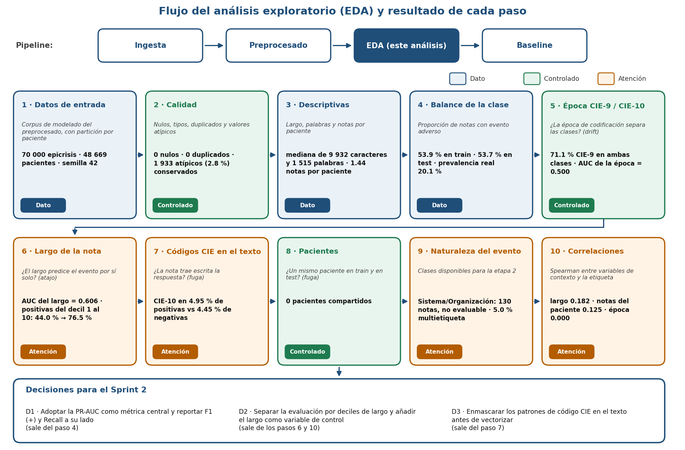
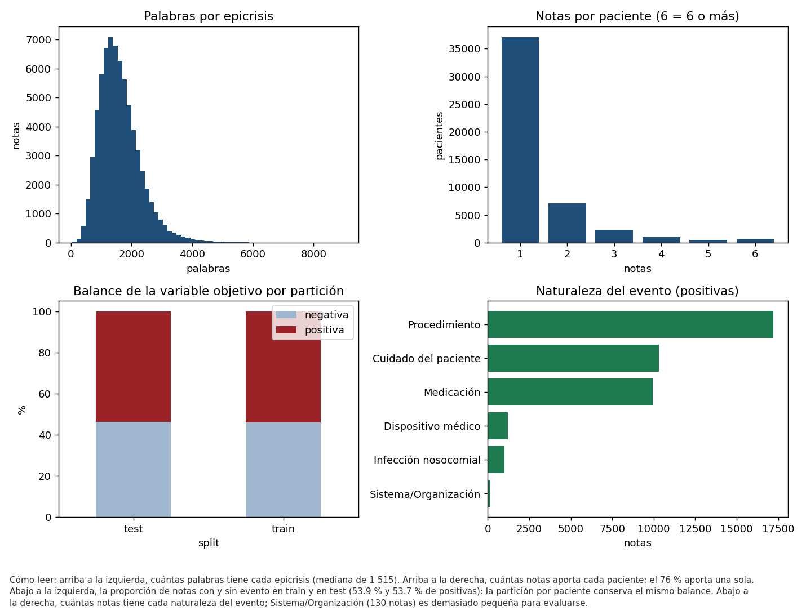
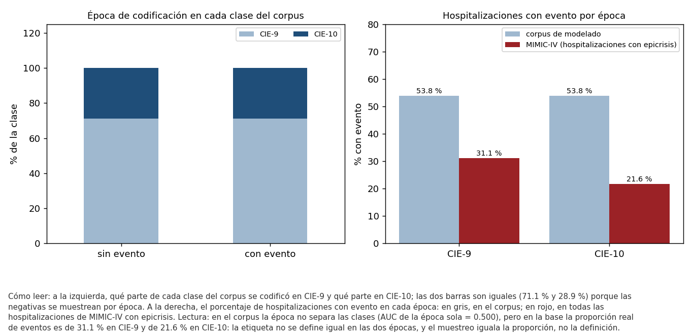
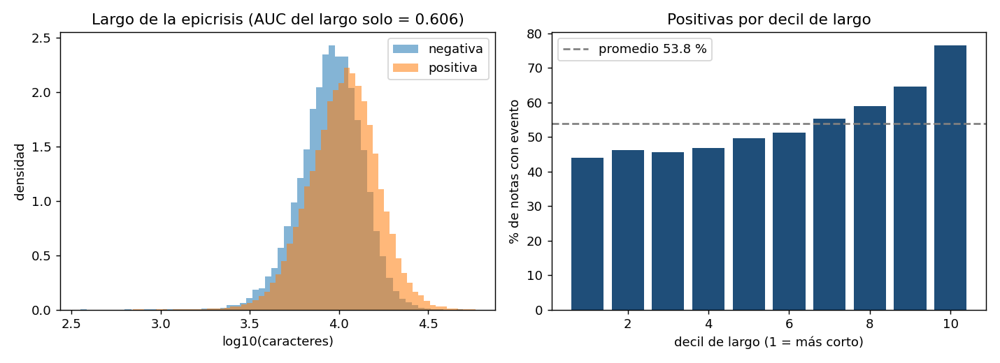
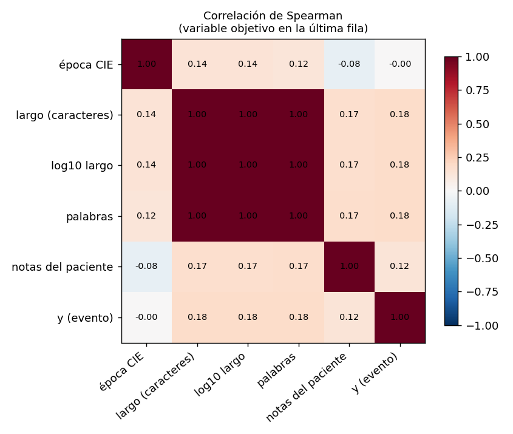

<p align="left"></p>

# 🏥 Detección de eventos adversos en epicrisis (MIMIC-IV) para su priorización con el Modelo GEMSES

Proyecto de investigación (Maestría en IA – UNI): un pipeline de PLN y aprendizaje automático que detecta, en la nota de alta hospitalaria, si la hospitalización tuvo un evento adverso. Es la base para priorizar esos eventos con la Matriz de Priorización del Modelo GEMSES.

Este repositorio forma parte del curso **Proyecto de Investigación II (MIA 403)**, dictado como **MIA-14 Trabajo de Investigación II**. Universidad Nacional de Ingeniería · Facultad de Ingeniería Industrial y de Sistemas · Unidad de Posgrado · Maestría en Inteligencia Artificial · ciclo 2026-2, sección B.

**Presentación del Sprint 1:** https://carlosperez100.github.io/mia14-trabajo-investigacion-ii-tesis-gemses-mimic/sprint1/

---

## 👥 Autores
- Carlos Pérez Pérez – [@carlosperez100](https://github.com/carlosperez100) · carlosperez100@gmail.com
- Docente: Dr. Ing. Glen Dario Rodríguez Rafael – [@GlenRodriguez](https://github.com/GlenRodriguez)

**Track:** A (venía de Proyecto I con un modelo entrenado, pero con un pipeline no reproducible; en el Sprint 1 se migró y se ordenó).

---

## 📊 Dataset
| | MIMIC-IV-Note v2.2 (texto) | MIMIC-IV v3.1 (diagnósticos) |
|---|---|---|
| **Fuente** | [PhysioNet – MIMIC-IV-Note v2.2](https://physionet.org/content/mimic-iv-note/2.2/) (acceso con credencial y DUA) | [PhysioNet – MIMIC-IV v3.1](https://physionet.org/content/mimiciv/3.1/) (acceso con credencial y DUA) |
| **Archivo** | `note/discharge.csv.gz` (1 139.2 MB) | `hosp/diagnoses_icd.csv.gz` (33.6 MB) |
| **Registros** | 331 793 epicrisis de 145 914 pacientes | 545 497 hospitalizaciones con diagnóstico |
| **Variables usadas** | `note_id`, `subject_id`, `hadm_id`, `text` | `hadm_id`, `icd_code`, `icd_version` |
| **Versión usada** | archivo del 11/05/2026 | archivo del 14/05/2026 |
| **Hash (SHA-256)** | `27bc552edaf81c2af322040cb7e8eb36417173b23c79405bb92fcf73bef2dbc5` | `47665a41b2a3ad990d6f314062d5bd6d29d467b0fd402dd94662044ec8b073d2` |

- **Variable objetivo `y` (0/1):** 1 si la hospitalización tiene un código CIE de semántica causal explícita de evento adverso (estrato A1, con equivalencias CIE-10-CM y familias CIE-9). Las tablas de etiquetas se registran con su hash en [`data/bitacora_datos.csv`](data/bitacora_datos.csv).
- **Corpus de trabajo:** 70 000 epicrisis (37 692 positivas) emparejadas por época de codificación. Partición por paciente: 55 915 de entrenamiento y 14 085 de test, con 0 pacientes compartidos.
- **Prevalencia real del evento en MIMIC-IV:** 20.12 % (109 775 de 545 497 hospitalizaciones).
- **Ética:** MIMIC está bajo el DUA de PhysioNet; no se redistribuye y no se publica texto clínico. Todo archivo de datos está excluido por `.gitignore`.

---

## 🗂️ Estructura del repositorio
```
data/
 ├── raw/                     # vacío en git: MIMIC se lee desde la ruta del .env (DUA)
 ├── interim/                 # etiquetas copiadas y época CIE (salida de la ingesta)
 ├── processed/               # dataset.parquet, splits.csv y modelos (fuera de git)
 └── bitacora_datos.csv       # versionado de datos: fuente, fecha, SHA-256 y tamaño
notebooks/
 └── 01_EDA_sprint1.ipynb     # EDA: calidad, distribuciones, riesgos y decisiones accionables
src/
 ├── run_pipeline.py          # orquestador: ingesta → preprocesado → eda → baseline
 ├── ingesta.py               # script de ingesta (idempotente, con hash)
 ├── preprocesado.py          # limpieza, emparejamiento y partición por paciente
 ├── eda.py                   # EDA reproducible con log automático y figuras (semana 4)
 ├── baseline.py              # Dummy + regresión logística (+ referencia de la tesis)
 ├── reporte_baseline.py      # escribe logs/metrics_baseline.txt y las matrices de confusión
 └── utils.py                 # configuración, logging y hash
config/config.yaml            # semilla, split e hiperparámetros
logs/                         # logs por etapa y metrics_baseline.txt
reportes/                     # resultados en JSON y figuras
slides/                       # presentación de resultados del sprint
entregables/                  # entregables por semana (diseño del pipeline de la semana 2, matriz de consistencia de la semana 3, roadmap y guion de la demo)
docs/                         # GitHub Pages
README.md
requirements.txt
.env.example
.gitignore
```

---

## ⚙️ Requisitos
- Python 3.13. Probado en Windows 11 con 15.6 GB de RAM (el corpus se limita a 70 000 notas por memoria; ver `n_max` en `config/config.yaml`).
- Credencial PhysioNet con acceso a MIMIC-IV v3.1 y MIMIC-IV-Note v2.2.

```bash
pip install -r requirements.txt
cp .env.example .env     # completar MIMIC_DIR, MIMIC_NOTE_DIR y ETIQUETAS_DIR
```

---

## 🚀 Cómo ejecutar el pipeline
Todo de una vez (unos 45 min en CPU):
```bash
python src/run_pipeline.py
```
O etapa por etapa:

1. **Ingesta de datos**
   ```bash
   python src/ingesta.py
   ```
   - Verifica las fuentes, calcula SHA-256 y escribe `data/bitacora_datos.csv`. La segunda ejecución no repite nada.

2. **Preprocesamiento**
   ```bash
   python src/preprocesado.py
   ```
   - Arma positivos y negativos emparejados por época, recupera el texto, limpia y hace la partición por paciente (semilla 42).
   - Guarda en `data/processed/` y deja los conteos de cada paso en `logs/preprocesado_*.log`.

3. **EDA (análisis exploratorio de datos)**
   ```bash
   python src/eda.py
   ```
   - Calidad, estadísticas descriptivas, balance, época, largo, fuga de códigos, pacientes, naturalezas y correlaciones; escribe `logs/eda_*.log`, `logs/metrics_eda.txt`, `reportes/eda_resumen.json` y las figuras `reportes/figuras/fig_eda_*.png`. Tarda unos 2 minutos.
   - La versión narrada, con interpretación de cada gráfico, está en `notebooks/01_EDA_sprint1.ipynb`.

4. **Entrenamiento baseline (Dummy / regresión logística)**
   ```bash
   python src/baseline.py                  # incluye la referencia de la tesis (~33 min más)
   python src/baseline.py --sin-referencia # solo los baselines
   ```
   - Genera `logs/metrics_baseline.txt`, `reportes/baseline_resultados.json` y las figuras de `reportes/figuras/`.

---

## 📈 Resultados (Semana 3, ejecución del 30/09/2026)
- **EDA inicial** en `notebooks/01_EDA_sprint1.ipynb`, con tres decisiones accionables para el Sprint 2.
- **Métrica central: PR-AUC**, junto con F1 de la clase positiva y Recall. El dummy que siempre dice «sí» obtiene F1 = 0.698, porque el test tiene 53.7 % de positivas; por eso el F1 solo no basta.

| Modelo (test) | F1 (+) | Recall | PR-AUC | ROC-AUC |
|---|---|---|---|---|
| Dummy (más frecuente) | 0.698 | 1.000 | 0.537 | 0.500 |
| Dummy (estratificado) | 0.550 | 0.555 | 0.541 | 0.510 |
| **Regresión logística TF-IDF** | **0.791** | **0.771** | **0.879** | **0.864** |
| Referencia: modelo de la tesis (LinearSVC) | 0.778 | 0.762 | 0.861 | 0.843 |

- **Reproducibilidad:** el pipeline vuelve a obtener el modelo de la tesis (sensibilidad 0.7623, especificidad 0.7699, ROC-AUC 0.8426) con diferencia 0.0000.
- **Logs de resultados:** [`logs/metrics_baseline.txt`](logs/metrics_baseline.txt).
- **Trazabilidad:** cada cifra de este README, de la presentación y del EDA tiene su fuente en [`reportes/TRAZABILIDAD_SPRINT1.md`](reportes/TRAZABILIDAD_SPRINT1.md).
- **Gráficos:** [curvas ROC y precisión-recall](reportes/figuras/fig_baseline_roc_pr.png) · [matrices de confusión](reportes/figuras/fig_matrices_confusion.png).
- **Slides de resultados:** [`slides/`](slides/) y la [presentación en línea](https://carlosperez100.github.io/mia14-trabajo-investigacion-ii-tesis-gemses-mimic/sprint1/).

---

## 🔎 EDA reproducible (Semana 4 · rama `sprint1-eda`)
Entregable «Github con el EDA». El análisis se ejecuta con un solo comando y deja registrado cada paso:

```bash
python src/eda.py
```

Lee el corpus que deja el preprocesado (70 000 epicrisis de 48 669 pacientes, partición por paciente con semilla 42), revisa diez puntos en orden y termina en tres decisiones para el siguiente sprint. En cada corrida escribe un log con hora (`logs/eda_*.log`), el resumen [`logs/metrics_eda.txt`](logs/metrics_eda.txt), todas las cifras en [`reportes/eda_resumen.json`](reportes/eda_resumen.json) y las figuras de esta sección. Solo produce agregados: ningún texto clínico sale del equipo.

### Flujo del análisis


Cada caja es un paso, con la pregunta que responde y su resultado. El color indica la lectura: **azul**, dato descriptivo; **verde**, riesgo revisado y controlado; **ámbar**, hallazgo que pide una acción en el siguiente sprint. La figura la genera el propio script con los resultados de la corrida.

### Resultados paso a paso

#### Pasos 1 a 4 · Datos, calidad, descriptivas y balance


- **Qué se hizo:** se revisaron nulos, tipos, duplicados y valores atípicos; se describieron el largo de las notas, las palabras, las notas por paciente y la proporción de la clase positiva en cada partición.
- **Qué salió:** 0 nulos en las columnas de datos y 0 duplicados de nota, hospitalización o texto. La epicrisis tiene una mediana de 9 932 caracteres y 1 515 palabras; 1 933 notas (2.8 %) son atípicas por largo. Cada paciente aporta 1.44 notas en promedio. La clase positiva es 53.9 % en train y 53.7 % en test.
- **Qué significa:** el dataset está limpio y las notas atípicas se conservan porque son notas reales. El balance viene de cómo se construyó el corpus de modelado, no de la realidad: en MIMIC-IV la prevalencia del evento es 20.1 %, por eso las métricas se reportan también a esa prevalencia.

#### Paso 5 · Época de codificación CIE-9 / CIE-10 (drift)


- **Qué se hizo:** se comparó la proporción de notas de cada época de codificación en las dos clases y se midió cuánto separa la época por sí sola (AUC).
- **Qué salió:** 71.1 % CIE-9 y 28.9 % CIE-10 en ambas clases; AUC de la época sola = 0.500.
- **Qué significa:** la época no da pistas sobre la etiqueta. Es el confusor que en una versión anterior del modelo inflaba el AUC, y el emparejamiento por época lo dejó controlado.

#### Paso 6 · Largo de la nota (atajo)


- **Qué se hizo:** se comparó el largo de las notas con y sin evento, y la proporción de positivas en cada decil de largo.
- **Qué salió:** las notas con evento son más largas (mediana de 10 717 frente a 9 185 caracteres). El largo solo da un AUC de 0.606, y la proporción de positivas sube de 44.0 % en el decil más corto a 76.5 % en el más largo.
- **Qué significa:** riesgo moderado de que el modelo aprenda «nota larga = evento». De aquí sale la decisión 2.

#### Pasos 7 y 8 · Fugas de información
- **Códigos CIE en el texto:** aparecen con formato CIE-10 en 4.95 % de las positivas y en 4.45 % de las negativas. La diferencia es pequeña pero real: la nota podría traer escrita parte de la respuesta. De aquí sale la decisión 3.
- **Pacientes:** 0 pacientes están a la vez en train y en test. La partición por paciente está bien hecha.

#### Paso 9 · Naturaleza del evento
Se ve en el panel inferior derecho de la figura de los pasos 1 a 4. Procedimiento tiene 17 209 notas, Cuidado del paciente 10 305, Medicación 9 933, Dispositivo médico 1 198, Infección nosocomial 1 007 y Sistema/Organización 130. El 5.0 % de las positivas tiene más de una naturaleza. Sistema/Organización no se puede evaluar con ese volumen en la etapa 2.

#### Paso 10 · Correlaciones


- **Qué se hizo:** correlación de Spearman entre las variables de contexto y la etiqueta, con la variable objetivo en la última fila.
- **Qué salió:** largo 0.182, palabras 0.181, notas del paciente 0.125 y época 0.000.
- **Qué significa:** la etiqueta casi no depende del contexto, así que la señal tiene que venir del contenido de la nota. El largo y el número de hospitalizaciones por paciente quedan vigilados.

### Resumen de resultados (ejecución del 08/10/2026)
| Qué vigila | Resultado | Lectura |
|---|---|---|
| Calidad | 0 nulos en las columnas de datos; 0 duplicados de `note_id`, `hadm_id` y texto; largo de 353 a 58 156 caracteres; 1 933 atípicos (2.8 %) | Dataset limpio; los atípicos son notas reales |
| Descriptivas | largo medio 10 684 caracteres (mediana 9 932); mediana de 1 515 palabras; 1.44 notas por paciente | Notas largas: la ventana de 256 tokens de un transformer cubre una fracción pequeña |
| Balance | 53.9 % de positivas en train y 53.7 % en test, frente a 20.1 % de prevalencia real | Corpus balanceado por construcción; métricas también a prevalencia real |
| Época CIE-9/CIE-10 (drift) | 71.1 % / 28.9 % en ambas clases; AUC de la época sola = 0.500 | Confusor controlado por el emparejamiento |
| Largo (atajo) | AUC del largo solo = 0.606; positivas por decil de 44.0 % a 76.5 % | Riesgo moderado de atajo |
| Códigos CIE en el texto (fuga) | CIE-10 en 4.95 % de positivas vs 4.45 % de negativas | Fuga pequeña pero real |
| Pacientes (fuga) | 0 pacientes compartidos entre train y test | Partición por paciente correcta |
| Naturalezas (etapa 2) | de 17 209 notas (Procedimiento) a 130 (Sistema/Organización); 5.0 % multietiqueta | Sistema/Organización no es evaluable |
| Correlaciones (Spearman) | largo 0.182 · palabras 0.181 · notas del paciente 0.125 · época 0.000 | La señal debe venir del contenido |

### Decisiones para el Sprint 2
Cada una tiene verbo, afecta un paso del pipeline, se puede ejecutar ya y tiene un control medible.
1. **Adoptar la PR-AUC como métrica central** y reportar F1 (+) y Recall a su lado [métrica]. Control: tabla de métricas con PR-AUC e IC 95 % frente al piso de 0.537.
2. **Separar la evaluación por deciles de largo** y añadir el largo como variable de control [split y features]. Control: PR-AUC dentro de cada decil.
3. **Enmascarar los patrones de código CIE** antes de vectorizar [preprocesado]. Control: PR-AUC con y sin máscara en la misma partición.

Versión narrada, con la interpretación de cada gráfico: [`notebooks/01_EDA_sprint1.ipynb`](notebooks/01_EDA_sprint1.ipynb).

---

## 📌 Roadmap
Las tareas, con responsable y plazo, están en los [issues](https://github.com/carlosperez100/mia14-trabajo-investigacion-ii-tesis-gemses-mimic/issues) y [milestones](https://github.com/carlosperez100/mia14-trabajo-investigacion-ii-tesis-gemses-mimic/milestones).
- [x] Semana 1 → Diagnóstico, estructura del repositorio y plan del Sprint 1.
- [x] Semana 2 → Ingesta + preprocesamiento + logging (entregable de diseño del pipeline: 18/20).
- [x] Semana 3 → EDA + baseline + demo interna (entregable del repositorio: 20/20).
- [x] Semana 4 → EDA reproducible con log automático (`src/eda.py`) en la rama `sprint1-eda`.
- [ ] Semanas 4–6 (Sprint 2) → Regenerar las etiquetas dentro del pipeline, GroupKFold por paciente, control del atajo por largo, máscara de códigos CIE y explicación de logística frente a LinearSVC.

---

## 📜 Licencia
Uso académico – Universidad Nacional de Ingeniería (UNI). Los datos de MIMIC-IV se rigen por el acuerdo de uso (DUA) de PhysioNet y no forman parte de este repositorio.
