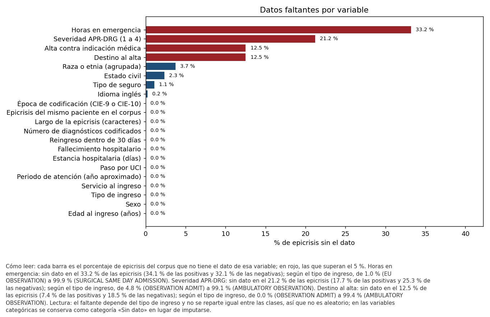
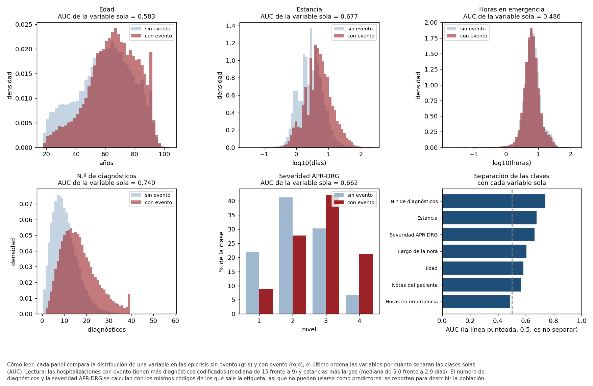
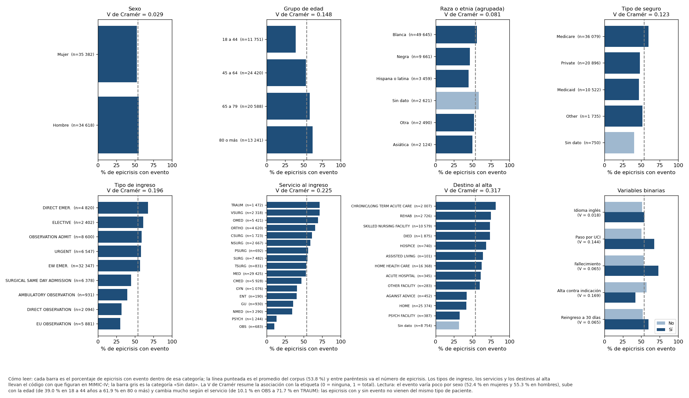
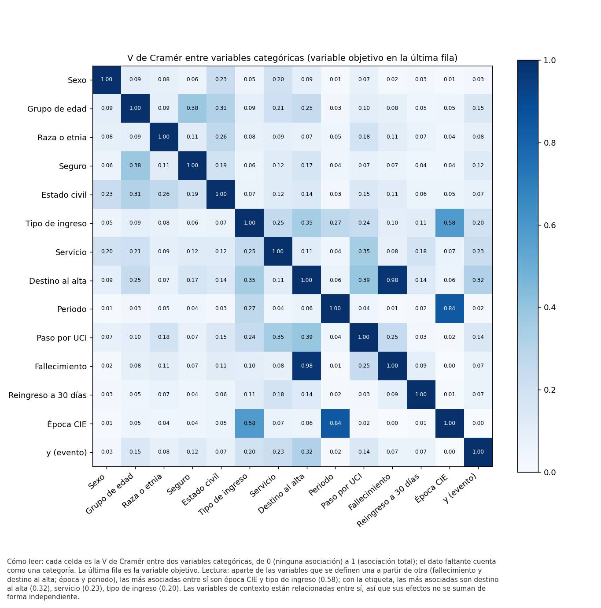
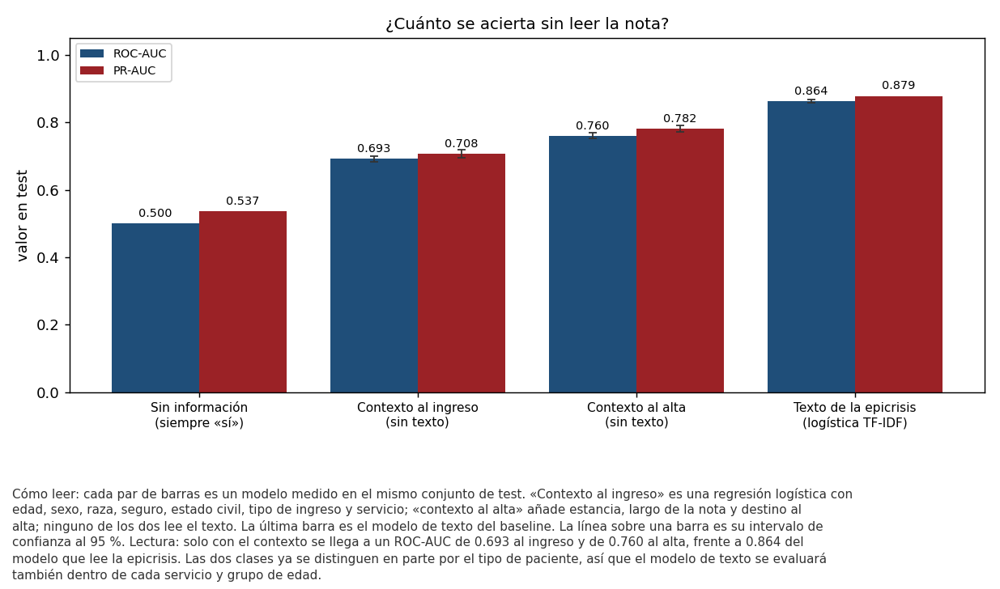
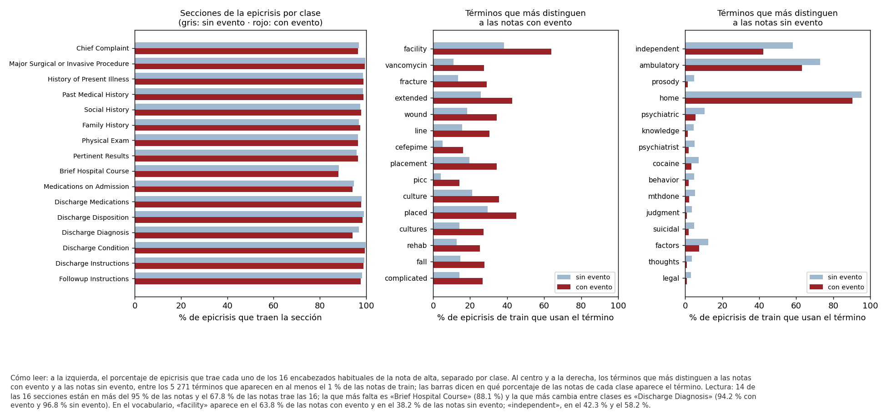
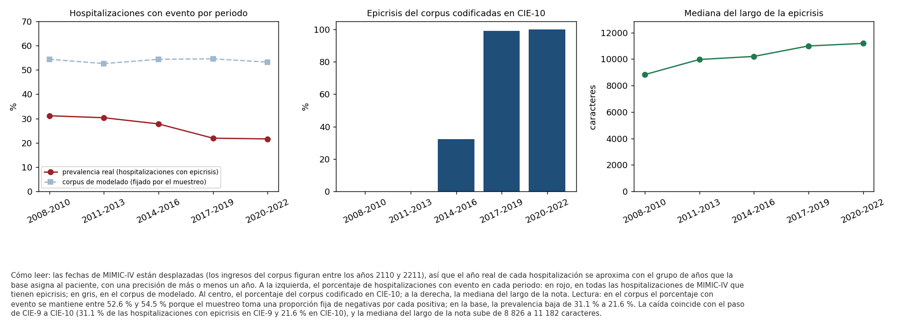
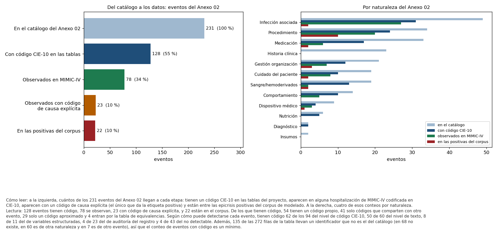
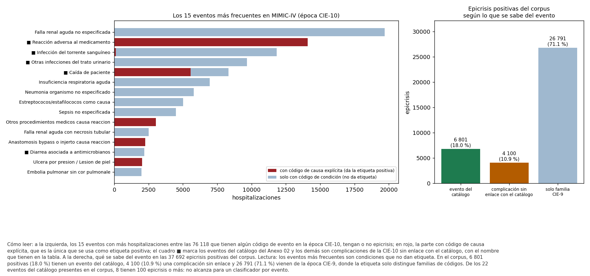

<p align="left"></p>

# 🏥 Detección de eventos adversos en epicrisis (MIMIC-IV) para su priorización con el Modelo GEMSES

Proyecto de investigación (Maestría en IA – UNI): un pipeline de PLN y aprendizaje automático que detecta, en la nota de alta hospitalaria, si la hospitalización tuvo un evento adverso. Es la base para priorizar esos eventos con la Matriz de Priorización del Modelo GEMSES.

Este repositorio forma parte del curso **Proyecto de Investigación II (MIA 403)**, dictado como **MIA-14 Trabajo de Investigación II**. Universidad Nacional de Ingeniería · Facultad de Ingeniería Industrial y de Sistemas · Unidad de Posgrado · Maestría en Inteligencia Artificial · ciclo 2026-2, sección B.

**Presentación del Sprint 1:** https://carlosperez100.github.io/mia14-trabajo-investigacion-ii-tesis-gemses-mimic/sprint1/

---

## 👥 Autores
- Carlos Pérez Pérez – [@carlosperez100](https://github.com/carlosperez100) · carlosperez100@gmail.com
- Docente: Dr. Ing. Glen Dario Rodríguez Rafael – [@GlenRodriguez](https://github.com/GlenRodriguez)

**Track:** A (venía de Proyecto I con un modelo entrenado, pero con un pipeline no reproducible; en el Sprint 1 se migró y se ordenó).

---

## 📊 Dataset
| | MIMIC-IV-Note v2.2 (texto) | MIMIC-IV v3.1 (diagnósticos) |
|---|---|---|
| **Fuente** | [PhysioNet – MIMIC-IV-Note v2.2](https://physionet.org/content/mimic-iv-note/2.2/) (acceso con credencial y DUA) | [PhysioNet – MIMIC-IV v3.1](https://physionet.org/content/mimiciv/3.1/) (acceso con credencial y DUA) |
| **Archivo** | `note/discharge.csv.gz` (1 139.2 MB) | `hosp/diagnoses_icd.csv.gz` (33.6 MB) |
| **Registros** | 331 793 epicrisis de 145 914 pacientes | 545 497 hospitalizaciones con diagnóstico |
| **Variables usadas** | `note_id`, `subject_id`, `hadm_id`, `text` | `hadm_id`, `icd_code`, `icd_version` |
| **Versión usada** | archivo del 11/05/2026 | archivo del 14/05/2026 |
| **Hash (SHA-256)** | `27bc552edaf81c2af322040cb7e8eb36417173b23c79405bb92fcf73bef2dbc5` | `47665a41b2a3ad990d6f314062d5bd6d29d467b0fd402dd94662044ec8b073d2` |

- **Variable objetivo `y` (0/1):** 1 si la hospitalización tiene un código CIE de semántica causal explícita de evento adverso (estrato A1, con equivalencias CIE-10-CM y familias CIE-9). Las tablas de etiquetas se registran con su hash en [`data/bitacora_datos.csv`](data/bitacora_datos.csv).
- **Corpus de trabajo:** 70 000 epicrisis (37 692 positivas) emparejadas por época de codificación. Partición por paciente: 55 915 de entrenamiento y 14 085 de test, con 0 pacientes compartidos.
- **Prevalencia real del evento en MIMIC-IV:** 20.12 % de las 545 497 hospitalizaciones con diagnóstico (109 775) y 27.59 % de las 331 604 que tienen epicrisis, que son las que el modelo puede leer (ver el EDA, punto 4.1).
- **Ética:** MIMIC está bajo el DUA de PhysioNet; no se redistribuye y no se publica texto clínico. Todo archivo de datos está excluido por `.gitignore`.

---

## 🗂️ Estructura del repositorio
```
data/
 ├── catalogos/               # catálogo de los 231 eventos del Anexo 02 y tabla evento-código CIE-10
 ├── raw/                     # vacío en git: MIMIC se lee desde la ruta del .env (DUA)
 ├── interim/                 # etiquetas copiadas y época CIE (salida de la ingesta)
 ├── processed/               # dataset.parquet, splits.csv y modelos (fuera de git)
 └── bitacora_datos.csv       # versionado de datos: fuente, fecha, SHA-256 y tamaño
notebooks/
 ├── 01_EDA_sprint1.ipynb     # primera versión del EDA (semana 3)
 └── 02_EDA_semana4.ipynb     # EDA desplegada: tablas y figuras de la última corrida de src/eda.py
src/
 ├── run_pipeline.py          # orquestador: ingesta → preprocesado → eda → baseline
 ├── ingesta.py               # script de ingesta (idempotente, con hash)
 ├── preprocesado.py          # limpieza, emparejamiento y partición por paciente
 ├── eda.py                   # EDA reproducible con log automático y figuras (semana 4)
 ├── eda_variables.py         # EDA de las variables de la hospitalización y de los eventos del Anexo 02
 ├── eda_texto.py             # EDA del contenido del texto: secciones y vocabulario
 ├── baseline.py              # Dummy + regresión logística (+ referencia de la tesis)
 ├── reporte_baseline.py      # escribe logs/metrics_baseline.txt y las matrices de confusión
 └── utils.py                 # configuración, logging y hash
config/config.yaml            # semilla, split e hiperparámetros
logs/                         # logs por etapa y metrics_baseline.txt
reportes/                     # resultados en JSON y CSV, y figuras
slides/                       # presentación de resultados del sprint
entregables/                  # entregables por semana (diseño del pipeline de la semana 2, matriz de consistencia de la semana 3, roadmap y guion de la demo)
docs/                         # GitHub Pages
README.md
requirements.txt
.env.example
.gitignore
```

---

## ⚙️ Requisitos
- Python 3.13. Probado en Windows 11 con 15.6 GB de RAM (el corpus se limita a 70 000 notas por memoria; ver `n_max` en `config/config.yaml`).
- Credencial PhysioNet con acceso a MIMIC-IV v3.1 y MIMIC-IV-Note v2.2.

```bash
pip install -r requirements.txt
cp .env.example .env     # completar MIMIC_DIR, MIMIC_NOTE_DIR y ETIQUETAS_DIR
```

---

## 🚀 Cómo ejecutar el pipeline
Todo de una vez (unos 45 min en CPU):
```bash
python src/run_pipeline.py
```
O etapa por etapa:

1. **Ingesta de datos**
   ```bash
   python src/ingesta.py
   ```
   - Verifica las fuentes, calcula SHA-256 y escribe `data/bitacora_datos.csv`. La segunda ejecución no repite nada.

2. **Preprocesamiento**
   ```bash
   python src/preprocesado.py
   ```
   - Arma positivos y negativos emparejados por época, recupera el texto, limpia y hace la partición por paciente (semilla 42).
   - Guarda en `data/processed/` y deja los conteos de cada paso en `logs/preprocesado_*.log`.

3. **EDA (análisis exploratorio de datos)**
   ```bash
   python src/eda.py
   ```
   - Calidad, variables de la hospitalización (faltantes, numéricas, categóricas y modelo de contexto), texto (largo, secciones, vocabulario y fugas), variable objetivo (prevalencia real, drift y ruido de la etiqueta), eventos del Anexo 02 y correlaciones; escribe `logs/eda_*.log`, `logs/metrics_eda.txt`, `reportes/eda_resumen.json`, `reportes/eda_eventos_231.csv` y las figuras `reportes/figuras/fig_eda_*.png`. Tarda unos 4 minutos.
   - Además de la salida del preprocesado, lee de `MIMIC_DIR` las tablas `admissions`, `patients`, `diagnoses_icd`, `d_icd_diagnoses`, `drgcodes`, `services` e `icustays`, y de `MIMIC_NOTE_DIR` la lista de hospitalizaciones con epicrisis.

4. **Entrenamiento baseline (Dummy / regresión logística)**
   ```bash
   python src/baseline.py                  # incluye la referencia de la tesis (~33 min más)
   python src/baseline.py --sin-referencia # solo los baselines
   ```
   - Genera `logs/metrics_baseline.txt`, `reportes/baseline_resultados.json` y las figuras de `reportes/figuras/`.

---

## 📈 Resultados (Semana 3, ejecución del 30/09/2026)
- **EDA inicial** en `notebooks/01_EDA_sprint1.ipynb`, con tres decisiones accionables para el Sprint 2.
- **Métrica central: PR-AUC**, junto con F1 de la clase positiva y Recall. El dummy que siempre dice «sí» obtiene F1 = 0.698, porque el test tiene 53.7 % de positivas; por eso el F1 solo no basta.

| Modelo (test) | F1 (+) | Recall | PR-AUC | ROC-AUC |
|---|---|---|---|---|
| Dummy (más frecuente) | 0.698 | 1.000 | 0.537 | 0.500 |
| Dummy (estratificado) | 0.550 | 0.555 | 0.541 | 0.510 |
| **Regresión logística TF-IDF** | **0.791** | **0.771** | **0.879** | **0.864** |
| Referencia: modelo de la tesis (LinearSVC) | 0.778 | 0.762 | 0.861 | 0.843 |

- **Reproducibilidad:** el pipeline vuelve a obtener el modelo de la tesis (sensibilidad 0.7623, especificidad 0.7699, ROC-AUC 0.8426) con diferencia 0.0000.
- **Logs de resultados:** [`logs/metrics_baseline.txt`](logs/metrics_baseline.txt).
- **Trazabilidad:** cada cifra de esta sección y de la presentación tiene su fuente en [`reportes/TRAZABILIDAD_SPRINT1.md`](reportes/TRAZABILIDAD_SPRINT1.md); las del EDA de la semana 4 salen de [`reportes/eda_resumen.json`](reportes/eda_resumen.json).
- **Gráficos:** [curvas ROC y precisión-recall](reportes/figuras/fig_baseline_roc_pr.png) · [matrices de confusión](reportes/figuras/fig_matrices_confusion.png).
- **Slides de resultados:** [`slides/`](slides/) y la [presentación en línea](https://carlosperez100.github.io/mia14-trabajo-investigacion-ii-tesis-gemses-mimic/sprint1/).

---

## 🔎 EDA reproducible (Semana 4 · rama `sprint1-eda`)
Entregable «Github con el EDA». El análisis se ejecuta con un solo comando y deja registrado cada paso:

```bash
python src/eda.py
```

Lee el corpus que deja el preprocesado (70 000 epicrisis de 48 669 pacientes, partición por paciente con semilla 42) y lo analiza en cuatro frentes: las **variables de cada hospitalización** (21 variables: 19 tomadas de seis tablas de MIMIC-IV y 2 de la propia nota), el **texto de la epicrisis**, la **variable objetivo** (cuánto evento hay en realidad y qué tan limpia es la etiqueta) y los **231 eventos del Anexo 02**. Termina en tres decisiones para el siguiente sprint.

En cada corrida escribe un log con hora (`logs/eda_*.log`), el resumen [`logs/metrics_eda.txt`](logs/metrics_eda.txt), todas las cifras en [`reportes/eda_resumen.json`](reportes/eda_resumen.json), una fila por evento del catálogo en [`reportes/eda_eventos_231.csv`](reportes/eda_eventos_231.csv) y las figuras de esta sección. Solo produce agregados: ningún texto clínico sale del equipo. Las cifras son de la ejecución del 09/10/2026 y describen el corpus completo, train y test; lo que se ajusta con los datos (el vocabulario y el modelo de contexto) se ajusta solo con train.

EDA desplegada: [`notebooks/02_EDA_semana4.ipynb`](notebooks/02_EDA_semana4.ipynb), con las tablas y las figuras de esta corrida. El cuaderno `01_EDA_sprint1.ipynb` conserva la primera versión, la de la semana 3.

### Flujo del análisis


Cada caja es un paso, con la pregunta que responde y su resultado. El color indica la lectura: **azul**, dato descriptivo; **verde**, riesgo revisado y controlado; **ámbar**, hallazgo que pide una acción. La figura la genera el propio script con los resultados de la corrida.

### Lo que cambia respecto de la versión anterior
La primera versión de este EDA solo miraba el texto. Al añadir las variables de la hospitalización y revisar la etiqueta, tres lecturas anteriores resultaron equivocadas y se corrigen aquí:

- **La «fuga de códigos CIE» no existe.** El patrón que se usó (letra, dos dígitos, punto y decimales) contaba sobre todo cadenas como `T98.2`, que por su valor son temperaturas y no códigos. Ver el punto 3.3.
- **La estabilidad en el tiempo era un efecto del muestreo.** En el corpus hay alrededor de 53.8 % de positivas en todos los periodos porque se toma una proporción fija de negativas por cada positiva. En la base, la proporción real de eventos baja de 31.1 % a 21.6 % al pasar de CIE-9 a CIE-10. Ver el punto 4.1.
- **La prevalencia real no es 20.1 %.** Ese valor divide entre todas las hospitalizaciones, tengan o no epicrisis. Entre las que tienen epicrisis, que son las que el modelo puede leer, es 27.6 %.

### 1 · Los datos: calidad, balance y partición


El corpus no tiene nulos en sus columnas ni duplicados de nota, hospitalización o texto. La epicrisis tiene una mediana de 9 932 caracteres y 1 515 palabras; 1 933 notas (2.8 %) son atípicas por largo y se conservan porque son notas reales. Cada paciente aporta 1.44 notas en promedio. Entre las variables de la hospitalización hay 11 estancias negativas (la hora de alta registrada es anterior a la de ingreso; 9 son de pacientes fallecidos).

Train y test se parecen, como se espera de una partición aleatoria por paciente:

| | Epicrisis | % con evento | Mediana de edad | Mediana de estancia (días) | Mediana del largo | % hombres | % con UCI | % en CIE-10 |
|---|---|---|---|---|---|---|---|---|
| Train | 55 915 | 53.9 | 64 | 3.88 | 9 915 | 49.3 | 21.7 | 28.6 |
| Test | 14 085 | 53.7 | 63 | 3.88 | 10 001 | 50.0 | 21.3 | 30.0 |

La única diferencia que conviene vigilar está en la época: en test, el 30.8 % de las positivas y el 29.2 % de las negativas son de CIE-10 (en train, 28.5 % y 28.9 %), y el AUC de la época sola es 0.508 en test.

### 2 · Las variables de cada hospitalización
Cada epicrisis se une por hospitalización con las tablas `admissions`, `patients`, `diagnoses_icd`, `drgcodes`, `services` e `icustays` de MIMIC-IV. Para cada variable se registra de dónde sale, en qué momento de la atención se conoce y para qué se puede usar: una variable que se conoce después del alta, o que sale de la misma codificación que la etiqueta, no puede ser predictor.

| Variable | Tipo | Tabla de MIMIC-IV | Se conoce en | Uso en el proyecto | % sin dato |
|---|---|---|---|---|---|
| Edad al ingreso | numérica | patients, admissions | ingreso | descripción y sesgo | 0.0 |
| Sexo | categórica | patients | ingreso | descripción y sesgo | 0.0 |
| Raza o etnia (agrupada) | categórica | admissions | ingreso | descripción y sesgo | 3.7 |
| Tipo de seguro | categórica | admissions | ingreso | descripción y sesgo | 1.1 |
| Idioma inglés | binaria | admissions | ingreso | descripción y sesgo | 0.2 |
| Estado civil | categórica | admissions | ingreso | descripción | 2.3 |
| Tipo de ingreso | categórica | admissions | ingreso | control | 0.0 |
| Servicio al ingreso | categórica | services | ingreso | control y evaluación por subgrupo | 0.0 |
| Horas en emergencia | numérica | admissions | ingreso | control | 33.2 |
| Periodo de atención (año aproximado) | categórica | patients, admissions | ingreso | drift temporal | 0.0 |
| Paso por UCI | binaria | icustays | estancia | control (puede ser consecuencia del evento) | 0.0 |
| Estancia hospitalaria (días) | numérica | admissions | alta | proxy de la dimensión Tiempo de GEMSES; no es predictor | 0.0 |
| Destino al alta | categórica | admissions | alta | descripción | 12.5 |
| Fallecimiento hospitalario | binaria | admissions | alta | desenlace; no es predictor | 0.0 |
| Alta contra indicación médica | binaria | admissions | alta | proxy de la dimensión Satisfacción de GEMSES | 12.5 |
| Reingreso dentro de 30 días | binaria | admissions | después del alta | proxy de la dimensión Satisfacción de GEMSES | 0.0 |
| Número de diagnósticos codificados | numérica | diagnoses_icd | codificación | contaminada por la etiqueta; no es predictor | 0.0 |
| Severidad APR-DRG (1 a 4) | numérica | drgcodes | codificación | insumo del proxy de la dimensión Costos de GEMSES (DRG); contaminada por la etiqueta | 21.2 |
| Largo de la epicrisis | numérica | nota de alta | alta | control del atajo por largo | 0.0 |
| Epicrisis del mismo paciente en el corpus | numérica | nota de alta | corpus | control | 0.0 |
| Época de codificación (CIE-9 o CIE-10) | categórica | diagnoses_icd | codificación | confusor | 0.0 |

#### 2.1 · Datos faltantes


Cuatro variables superan el 5 % de faltantes: horas en emergencia (33.2 %), severidad APR-DRG (21.2 %), destino al alta y alta contra indicación médica (12.5 %; la segunda se deriva de la primera). En la raza, las respuestas «desconocida», «no se pudo obtener» y «el paciente no quiso responder» se cuentan como dato faltante (3.7 %).

El faltante depende del tipo de ingreso (con el código de MIMIC-IV). El destino al alta falta en el 96.8 % o más de tres tipos de ingreso en observación (`AMBULATORY OBSERVATION`, `EU OBSERVATION` y `DIRECT OBSERVATION`) y en el 0.2 % o menos del resto. Las horas en emergencia faltan en el 99.9 % de los ingresos `SURGICAL SAME DAY ADMISSION` y en el 4.2 % de los `EW EMER.`. Tampoco se reparte igual entre las clases: cuando falta el destino al alta, el 31.7 % de las epicrisis tiene evento; cuando no falta, el 57.0 %.

El faltante no es aleatorio y lleva información sobre el tipo de atención. Por eso no se imputa con un valor central: en las variables categóricas se conserva como una categoría más, «Sin dato», y así entra en todas las medidas de asociación.

#### 2.2 · Variables numéricas


| Variable | Media | Desv. | Mín. | Q1 | Mediana | Q3 | Máx. | Atípicos (IQR) | Mediana sin evento | Mediana con evento | AUC sola |
|---|---|---|---|---|---|---|---|---|---|---|---|
| Edad (años) | 62.36 | 17.79 | 18 | 51 | 64 | 76 | 103 | 0.00 % | 61 | 66 | 0.583 |
| Estancia (días) | 6.14 | 8.12 | −0.95 | 1.99 | 3.88 | 6.98 | 230.69 | 8.11 % | 2.88 | 5.00 | 0.677 |
| Horas en emergencia | 7.67 | 5.58 | 0.00 | 4.58 | 6.33 | 8.85 | 139.33 | 7.15 % | 6.43 | 6.25 | 0.486 |
| N.º de diagnósticos | 13.59 | 7.63 | 1 | 8 | 12 | 18 | 57 | 2.11 % | 9 | 15 | 0.740 |
| Severidad APR-DRG | 2.52 | 0.92 | 1 | 2 | 3 | 3 | 4 | 0.00 % | 2 | 3 | 0.662 |
| Largo de la nota (caracteres) | 10 684 | 4 643 | 353 | 7 453 | 9 932 | 13 024 | 58 156 | 2.76 % | 9 185 | 10 717 | 0.606 |
| Epicrisis del mismo paciente | 2.32 | 2.40 | 1 | 1 | 1 | 3 | 27 | 5.55 % | 1 | 2 | 0.566 |

Los atípicos se cuentan con la regla de 1.5 veces el rango intercuartílico, y la última columna es el AUC que se obtiene usando solo esa variable (0.5 es no separar las clases). La última fila se calcula por nota, por eso su media (2.32) es mayor que las 1.44 notas por paciente del punto 1.

Las hospitalizaciones con evento tienen más diagnósticos codificados (mediana de 15 frente a 9), estancias más largas (5.0 frente a 2.9 días), más severidad y más edad (66 frente a 61 años). Las horas en emergencia no separan las clases. La edad máxima es 103 años, pero las edades más altas no son exactas: según la descripción de MIMIC-IV en PhysioNet, la base asigna 91 años a los pacientes que tenían más de 89 en su año de referencia.

El número de diagnósticos y la severidad APR-DRG son las variables que más separan, pero se calculan con los mismos códigos de los que sale la etiqueta: usarlas como predictores sería fuga. Se reportan para describir la población, y la estancia queda como proxy de la dimensión Tiempo de la matriz GEMSES.

#### 2.3 · Variables categóricas



La primera figura da el porcentaje de epicrisis con evento en cada categoría y la V de Cramér de cada variable con la etiqueta (0 es ninguna asociación; 1, asociación total). Las categorías con menos de 50 casos se agrupan en «Otros». La segunda es la matriz de asociación entre las variables categóricas, con la variable objetivo en la última fila.

Las asociaciones más fuertes con la etiqueta son las del destino al alta (V = 0.317), el servicio (0.225), el tipo de ingreso (0.196), el grupo de edad (0.148) y el paso por UCI (0.144). La del alta contra indicación médica (0.169) viene de su categoría «Sin dato», que es la misma del destino al alta. Por servicio (con el código de MIMIC-IV), el evento va de 10.1 % en `OBS` y 13.2 % en `PSYCH` a 71.6 % en `VSURG` y 71.7 % en `TRAUM`. Por edad, de 39.0 % en 18 a 44 años a 61.9 % en 80 o más. Por sexo casi no cambia (52.4 % en mujeres y 55.3 % en hombres; V = 0.029). Por seguro, 59.7 % en Medicare frente a 46.7 % en Medicaid; por raza, 55.9 % en pacientes blancos, 46.4 % en negros y 44.9 % en hispanos.

Entre las variables, y aparte de las que se definen una a partir de otra, la asociación más alta es la del tipo de ingreso con la época de codificación (V = 0.579): el reparto de los tipos de ingreso cambia entre épocas (`EW EMER.` es el 57.1 % de las epicrisis de CIE-9 y el 19.6 % de las de CIE-10; `OBSERVATION ADMIT`, el 0.9 % y el 40.2 %). Siguen el paso por UCI con el destino al alta (0.394) y el seguro con el grupo de edad (0.380).

Las epicrisis con y sin evento no vienen del mismo tipo de paciente. Las negativas tienen más pacientes jóvenes y más ingresos en observación, y casi todas las notas de los servicios `PSYCH` y `OBS` son negativas. Es un riesgo de sesgo: el modelo puede rendir distinto por subgrupo, así que las métricas se reportarán también por servicio, tipo de ingreso, sexo, grupo de edad, raza y seguro.

#### 2.4 · ¿Cuánto se acierta sin leer la nota?


Se ajustó en train una regresión logística que no lee el texto, sin buscar hiperparámetros, y se midió en el mismo test del baseline. Tiene dos versiones: con lo que se sabe al ingreso (edad, sexo, raza, seguro, estado civil, tipo de ingreso y servicio) y con lo que se sabe al alta (se añaden estancia, largo de la nota y destino al alta). No incluye el número de diagnósticos ni la severidad APR-DRG.

| Modelo (test) | ROC-AUC | IC 95 % | PR-AUC |
|---|---|---|---|
| Siempre «sí» | 0.500 | | 0.537 |
| Contexto al ingreso, sin texto | 0.693 | 0.683 a 0.701 | 0.708 |
| Contexto al alta, sin texto | 0.760 | 0.752 a 0.769 | 0.782 |
| Texto de la epicrisis (logística TF-IDF del baseline) | 0.864 | 0.858 a 0.869 | 0.879 |

El intervalo de confianza de los modelos de contexto se obtuvo remuestreando pacientes del test; el del modelo de texto es el que reporta el baseline. Sin leer una sola palabra de la nota ya se separan las clases con un ROC-AUC de 0.693 al ingreso y de 0.760 al alta. El modelo de texto llega a 0.864, pero este resultado obliga a preguntarse cuánto de eso viene de reconocer el tipo de paciente y cuánto de reconocer el evento. De aquí sale la decisión 3.

### 3 · El texto de la epicrisis

#### 3.1 · Largo de la nota (atajo)


Las notas con evento son más largas (mediana de 10 717 frente a 9 185 caracteres). El largo solo da un AUC de 0.606, y la proporción de positivas sube de 44.0 % en el decil más corto a 76.5 % en el más largo. Hay un riesgo moderado de que el modelo aprenda «nota larga = evento». El largo se mueve junto con la estancia (Spearman 0.468) y con el número de diagnósticos (0.559): una hospitalización larga y compleja produce una nota larga.

#### 3.2 · Secciones y vocabulario


Se buscó en cada nota la presencia de 16 encabezados habituales de la epicrisis de MIMIC-IV, que es el equivalente a los datos faltantes dentro del texto. Catorce de los 16 están en más del 95 % de las notas y el 67.8 % de las notas trae los 16. El que más falta es el curso hospitalario (*Brief Hospital Course*, 88.1 %) y el que más cambia entre clases es el diagnóstico de alta (*Discharge Diagnosis*: 94.2 % con evento y 96.8 % sin evento). El número de secciones no separa las clases (AUC 0.493): la estructura de la nota es la misma en las dos y no es un atajo.

Para el vocabulario se contaron, solo en train, los 5 271 términos que aparecen en al menos el 1 % de las notas, y se ordenaron por cuánto más aparecen en una clase que en la otra (razón de odds dividida entre su error estándar, para que un término raro no quede arriba solo por ser raro).

- **Más propios de las notas con evento:** *facility* (63.8 % de las notas con evento y 38.2 % de las notas sin evento), *vancomycin*, *fracture*, *extended*, *wound*, *line*, *cefepime*, *placement*, *picc*, *culture*, *placed*, *cultures*, *rehab*, *fall* y *complicated*.
- **Más propios de las notas sin evento:** *independent* (42.3 % y 58.2 %), *ambulatory*, *prosody*, *home*, *psychiatric*, *knowledge*, *psychiatrist*, *cocaine*, *behavior*, *mthdone*, *judgment*, *suicidal*, *factors*, *thoughts* y *legal*.

El vocabulario confirma las dos lecturas del punto 2. Del lado del evento hay palabras ligadas a complicaciones (*wound*, *complicated*) y a infecciones y catéteres (*vancomycin*, *cefepime*, *picc*, *line*), que también describen a un paciente complejo; y hay palabras del destino del paciente (*facility*, *rehab*, *extended*) y de las caídas con fractura (*fall*, *fracture*), que se revisan en el punto 4.2. Del lado sin evento no hay palabras de «ausencia de evento»: son términos de notas psiquiátricas (*psychiatric*, *suicidal*, *prosody*) y de pacientes que se van a casa caminando (*home*, *ambulatory*, *independent*). El modelo puede reconocer la clase negativa por la especialidad y por el estado funcional.

#### 3.3 · Fugas de información
- **Códigos CIE en el texto.** La versión anterior reportó cadenas con forma de código CIE-10 en el 4.95 % de las positivas y el 4.45 % de las negativas, y propuso enmascararlas. Al revisar qué captura ese patrón, el 72.5 % de las 4 241 coincidencias son `T95` a `T99` con un decimal (las más frecuentes, `T98.2`, `T98.1` y `T98.3`): por su valor son temperaturas corporales en grados Fahrenheit, y en el diccionario de diagnósticos de MIMIC-IV no existe ningún código T95 a T99. Se repitió la búsqueda solo con los códigos de las familias de las que sale la etiqueta, escritos con punto: con la forma de CIE-10 aparecen en 20 notas, todas positivas, y con la forma de CIE-9 en 24 (17 positivas y 7 negativas). Son 44 notas en total: el 0.10 % de las positivas y el 0.02 % de las negativas. La búsqueda es por patrón, y un número con la misma forma también cuenta, así que es una cota superior. No hay fuga, y la decisión de enmascarar se retira.
- **Pacientes.** Ningún paciente está a la vez en train y en test.

### 4 · La variable objetivo
La variable objetivo es binaria: la epicrisis corresponde, o no, a una hospitalización con un evento adverso. La etiqueta no se anotó a mano; sale de códigos de diagnóstico que el proyecto toma como señal de un daño causado por la atención. En la época CIE-10 son los códigos de la tabla del proyecto que pertenecen a estas familias: complicaciones de la atención médica y quirúrgica (T80 a T88), incidentes en la asistencia (Y63, Y65), procedimientos como causa de una reacción anormal (Y83, Y84), caídas (W00 a W19) y úlcera por presión (L89), más los efectos adversos de medicamentos en uso terapéutico y algunas complicaciones de procedimientos que se identifican por sus equivalentes en CIE-10-CM. En la época CIE-9 se usan cinco familias completas. Los códigos de condiciones como la insuficiencia renal aguda, la neumonía o la sepsis no dan etiqueta, porque la tabla de diagnósticos de MIMIC-IV no indica si la condición ya estaba presente al ingreso.

#### 4.1 · Balance, prevalencia real y drift



El corpus de modelado tiene 53.8 % de positivas (53.9 % en train y 53.7 % en test) porque se construye tomando una proporción fija de negativas por cada positiva dentro de cada época de codificación. Ese balance no es el de la realidad, así que se midió la proporción de eventos en toda la base:

| | Hospitalizaciones con diagnóstico | % con evento | Con epicrisis | % con evento entre las que tienen epicrisis |
|---|---|---|---|---|
| Todas | 545 497 | 20.12 | 331 604 | 27.59 |
| Época CIE-9 | 291 120 | 25.67 | 209 316 | 31.06 |
| Época CIE-10 | 254 377 | 13.77 | 122 288 | 21.64 |
| 2008-2010 | 103 317 | 25.35 | 70 862 | 31.12 |
| 2011-2013 | 116 824 | 25.11 | 85 637 | 30.31 |
| 2014-2016 | 116 967 | 22.83 | 87 640 | 27.78 |
| 2017-2019 | 113 866 | 16.44 | 79 789 | 21.90 |
| 2020-2022 | 94 523 | 9.32 | 7 676 | 21.60 |

Las fechas de MIMIC-IV están desplazadas (los ingresos del corpus figuran entre los años 2110 y 2211), así que el año real de cada hospitalización se aproximó con el grupo de años que la base asigna a cada paciente, con una precisión de más o menos un año.

Tres lecturas:

1. **La prevalencia que corresponde al modelo es 27.6 %, no 20.1 %.** El modelo solo puede leer hospitalizaciones con epicrisis. Además, las tres fuentes de positivas no tienen la misma cobertura de notas: tienen epicrisis el 100 % de las positivas por códigos de la tabla (esa tabla se armó a partir de las notas), el 87.0 % de las de familias CIE-9 y el 55.2 % de las de equivalencias CIE-10-CM. El valor predictivo positivo «a prevalencia real» del baseline se calculó con 20.1 % y hay que recalcularlo.
2. **La etiqueta no es estable en el tiempo.** La proporción real de eventos baja de 31.1 % en 2008-2010 a 21.6 % en 2020-2022. La caída está en el cambio de codificación: dentro del mismo periodo 2014-2016, las hospitalizaciones codificadas en CIE-9 tienen 32.2 % de eventos y las codificadas en CIE-10, 21.2 %. La diferencia aparece con el cambio de codificación y no con el paso del tiempo, y la explica la definición de la etiqueta: familias completas en CIE-9 y una lista de códigos en CIE-10. Si en CIE-10 dieran etiqueta todos los códigos de esas familias, la proporción de eventos entre las hospitalizaciones con epicrisis sería 31.8 %, prácticamente la de CIE-9 (31.1 %).
3. **El muestreo por época iguala la proporción, no la definición.** En el corpus la época no separa las clases (AUC de la época sola = 0.500; 71.1 % CIE-9 y 28.9 % CIE-10 en ambas), y eso evita que el modelo aprenda la época en lugar del evento. Pero una positiva de CIE-9 y una de CIE-10 no significan lo mismo, y por eso las métricas se reportarán también por época.

Lo que sí cambia en el corpus con los años es la forma de documentar: la mediana del largo de la nota sube de 8 826 caracteres en 2008-2010 a 11 182 en 2020-2022. El último periodo tiene solo 1 194 notas, así que sus métricas tendrán intervalos anchos.

#### 4.2 · Ruido de la etiqueta
Se revisó cada clase buscando casos que, por los códigos de la propia base, podrían estar mal puestos.

**Negativas con códigos de causa explícita.** De las 9 345 negativas de la época CIE-10, 805 (8.6 %) llevan un código de las mismas familias que dan la etiqueta, pero que no está en la tabla del proyecto: 451 un código de las familias T80 a T88, Y63, Y65, Y83, Y84, W00 a W19 o L89, y 368 un efecto adverso de medicamento (T36 a T50 con el carácter de efecto adverso). Los más frecuentes son el efecto adverso de glucocorticoides (T38.0X5A, 102 notas) y dos procedimientos quirúrgicos como causa de una reacción (Y83.8, 88 notas; Y83.1, 71 notas). En la época CIE-9, donde se usan las familias completas, no hay ninguna (0 de 22 963). Esas 805 notas se le están enseñando al modelo como «sin evento». De aquí sale la decisión 1.

**Positivas que lo son solo por una caída.** 6 296 positivas (16.7 %) tienen como única evidencia un código de caída. Los códigos de caída son de causa externa: dicen que hubo una caída, no dónde ocurrió; el lugar va en otro código.

| | Positivas solo por caída | Con código de lugar | Lugar: hospital | Lugar: casa |
|---|---|---|---|---|
| Época CIE-10 | 2 010 | 1 706 | 159 (7.9 %) | 884 |
| Época CIE-9 | 4 286 | 1 630 | — | 813 |

Los códigos de lugar se tomaron con el título que tienen en el diccionario de MIMIC-IV: en CIE-10, Y92.23 (hospital) e Y92.0 (residencia privada); en CIE-9, E849.0 (accidentes en el hogar). Ninguno de los diez códigos de lugar de CIE-9 que trae el diccionario corresponde al hospital; el más cercano es E849.7 (accidentes en institución residencial), con 240 casos. En total, solo 159 de las 6 296 tienen el hospital como lugar de ocurrencia, y 2 960 no tienen código de lugar. Donde se conoce el lugar, lo más frecuente es la casa, es decir, una caída anterior al ingreso: no es un evento adverso de la atención. Explican buena parte de las diferencias por servicio del punto 2.3: son solo por caída el 74.2 % de las positivas de `TRAUM`, el 51.1 % de las de `NSURG` y el 47.7 % de las de `ORTHO`. De aquí sale la decisión 2.

**Positivas de la familia de úlcera en CIE-9.** La familia que el proyecto llama «úlcera por presión» se define en CIE-9 como 707.x. De sus 2 736 positivas, 1 739 (63.6 %) no tienen ningún código 707.0x, que es el de úlcera por presión, y 1 652 de ellas tienen un código 707.1x, úlcera de miembro inferior. Es otra fuente de positivas que no corresponden al evento, y queda registrada como acción.

#### 4.3 · Naturaleza del evento
Para la segunda etapa del modelo las positivas se agrupan en seis naturalezas, que salen de la naturaleza asignada a cada código (es una agrupación propia del modelo, distinta de las 12 naturalezas del catálogo del punto 5). Se ven en el panel inferior derecho de la figura del punto 1.

| Naturaleza | Notas | En CIE-9 | En CIE-10 |
|---|---|---|---|
| Procedimiento | 17 209 | 13 005 | 4 204 |
| Cuidado del paciente | 10 305 | 7 155 | 3 150 |
| Medicación | 9 933 | 6 630 | 3 303 |
| Dispositivo médico | 1 198 | 0 | 1 198 |
| Infección nosocomial | 1 007 | 0 | 1 007 |
| Sistema/Organización | 130 | 0 | 130 |

Tres naturalezas existen solo en la época CIE-10, porque las familias de CIE-9 no las distinguen. Por la misma razón, ninguna positiva de CIE-9 tiene más de una naturaleza, frente al 17.1 % de las de CIE-10 (5.0 % en total). Sistema/Organización no se puede evaluar con 130 notas.

### 5 · Los 231 eventos del Anexo 02
El catálogo de los 231 eventos (12 naturalezas) y la tabla de códigos están versionados en [`data/catalogos/`](data/catalogos/). El resultado por evento, con una fila para cada uno de los 231, está en [`reportes/eda_eventos_231.csv`](reportes/eda_eventos_231.csv).



Se siguió a cada evento del catálogo hasta los datos, en cinco etapas que se contienen una a otra:

| Etapa | Eventos | % del catálogo |
|---|---|---|
| En el catálogo del Anexo 02 | 231 | 100 |
| Con código CIE-10 en las tablas del proyecto | 128 | 55 |
| Observados en alguna hospitalización de MIMIC-IV (época CIE-10) | 78 | 34 |
| Observados con un código de causa explícita, el que da la etiqueta | 23 | 10 |
| Presentes en las epicrisis positivas del corpus | 22 | 10 |

| Naturaleza (Anexo 02) | En el catálogo | Con código | Observados | Con código de causa explícita | En las positivas del corpus |
|---|---|---|---|---|---|
| Infección asociada | 49 | 31 | 27 | 3 | 2 |
| Procedimiento | 34 | 24 | 20 | 10 | 10 |
| Medicación | 33 | 17 | 6 | 2 | 2 |
| Historia clínica | 23 | 0 | 0 | 0 | 0 |
| Gestión organización | 21 | 12 | 7 | 3 | 3 |
| Cuidado del paciente | 19 | 10 | 8 | 2 | 2 |
| Sangre/hemoderivados | 19 | 13 | 2 | 2 | 2 |
| Comportamiento | 14 | 10 | 5 | 0 | 0 |
| Dispositivo médico | 9 | 4 | 3 | 1 | 1 |
| Nutrición | 6 | 5 | 0 | 0 | 0 |
| Diagnóstico | 2 | 2 | 0 | 0 | 0 |
| Insumos | 2 | 0 | 0 | 0 | 0 |
| **Total** | **231** | **128** | **78** | **23** | **22** |

**Qué código tiene cada evento.** De los 128 eventos con código, 54 tienen un código propio, 41 solo códigos que comparten con otro evento, 29 solo un código aproximado y 4 entran por la tabla de equivalencias CIE-10-CM. Los 103 restantes no tienen código: Historia clínica (23 eventos) e Insumos (2) no tienen ninguno, y Nutrición y Diagnóstico tienen código pero ningún caso. Según cómo puede detectarse cada evento, tienen código 62 de los 94 que se detectan por código CIE-10, 50 de los 60 que se detectan en el texto de las notas, 8 de los 11 que requieren variables estructuradas, 4 de los 23 que requieren auditar el registro y 4 de los 43 que no son detectables en MIMIC-IV.

**Qué evidencia hay de cada evento.** De los 78 eventos observados, 55 aparecen solo con códigos de condición, que el proyecto no usa como etiqueta porque pueden ser el motivo de ingreso. Solo 23 tienen algún caso con código de causa explícita, y 22 llegan a las positivas del corpus.

**Calidad de la tabla de códigos.** La tabla tiene 272 filas y 223 códigos. En 135 filas, todas tomadas de la CIE-10 de la OMS, el identificador del evento no es el del catálogo: en 68 no existe en el catálogo, en 60 corresponde a otra naturaleza y en 7 a otro evento de la misma naturaleza. Esas filas describen complicaciones (hemorragia tras un procedimiento, infección tras un procedimiento, úlcera por presión), pero no dicen a qué evento del catálogo corresponden. Por eso el conteo de 128 es un mínimo: de los 32 eventos que se detectan por código CIE-10 y quedan sin código, al menos 12 tienen su código en una de esas filas. No afecta a la etiqueta binaria ni a la naturaleza, que se asignan por código.



**Frecuencia y origen de la etiqueta.** Contando también las complicaciones sin enlace, se observan 157 eventos en 76 118 hospitalizaciones de la época CIE-10 (tengan o no epicrisis), y 24 de ellos concentran el 80 % de los casos. El más frecuente, la falla renal aguda no especificada (19 705 hospitalizaciones), es una condición y no da etiqueta. Los que más aportan a la etiqueta son la reacción adversa al medicamento (14 090) y la caída de paciente (5 551).

En el corpus, de las 37 692 epicrisis positivas, 6 801 (18.0 %) tienen un evento del catálogo, 4 100 (10.9 %) una complicación sin enlace con el catálogo y 26 791 (71.1 %) vienen de la época CIE-9, donde la etiqueta solo distingue cinco familias: complicaciones de la atención (11 504), fármacos en uso terapéutico (6 630), caídas (4 419), úlcera de piel, 707.x (2 737) e incidentes asistenciales (1 501). De los 22 eventos del catálogo presentes en el corpus, solo 8 tienen 100 epicrisis o más y 7 tienen 30 o más en test.

La respuesta a «dónde están los 231 eventos» es esta: algo más de la mitad tiene código, un tercio se llega a observar, y solo uno de cada diez participa en la etiqueta con la que se entrena el modelo. Los eventos de historia clínica y de insumos no tienen código de diagnóstico, y los de comportamiento, nutrición y diagnóstico no aparecen con código de causa explícita: para ellos haría falta el texto de las notas u otras tablas. Con estos datos no se puede entrenar un clasificador por evento, y por eso el modelo trabaja en dos etapas: primero detección binaria y después naturaleza del evento.

### 6 · Correlaciones


Matriz de correlación de Spearman entre 12 variables y la variable objetivo, que va en la última fila; cada celda usa las epicrisis que tienen los dos datos. Con la etiqueta, las correlaciones más altas son las del número de diagnósticos (0.415), la estancia (0.306), la severidad APR-DRG (0.293), el largo de la nota (0.182), la edad (0.144) y el paso por UCI (0.144); la época de codificación da 0.000. Entre las variables, las más altas son severidad con número de diagnósticos (0.637), número de diagnósticos con largo de la nota (0.559) y estancia con largo de la nota (0.468).

Ninguna variable aislada explica la etiqueta, pero varias empujan en la misma dirección y están correlacionadas entre sí: describen al paciente complejo, con muchos diagnósticos, estancia larga y nota larga. Es la misma lectura del punto 2.4.

### Resumen de riesgos
| Riesgo | Evidencia | Estado |
|---|---|---|
| Desbalance | 53.8 % de positivas en el corpus; 27.6 % en las hospitalizaciones con epicrisis | PR-AUC como métrica central; recalcular el valor predictivo positivo con 27.6 % |
| Ruido en las negativas | 8.6 % de las negativas CIE-10 con un código de causa explícita que no está en la tabla | Decisión 1 |
| Ruido en las positivas | 16.7 % de las positivas solo por caída y solo 159 con el hospital como lugar; 1 739 positivas de la familia de úlcera en CIE-9 sin código de úlcera por presión | Decisión 2 y acción registrada |
| Mezcla de casos | Sin leer la nota se llega a ROC-AUC 0.693 (ingreso) y 0.760 (alta); el modelo de texto, 0.864 | Decisión 3 |
| Atajo por largo | AUC del largo solo = 0.606; positivas por decil de 44.0 % a 76.5 % | Decisión 3 |
| Sesgo por subgrupo | Evento de 10.1 % a 71.7 % según el servicio; V de Cramér 0.225 | Métricas por subgrupo |
| Drift de la etiqueta | Prevalencia real de 31.1 % en CIE-9 y 21.6 % en CIE-10; en el corpus queda igualada por el muestreo | Métricas por época y por periodo |
| Fuga de la etiqueta | Códigos de las familias de la etiqueta escritos en 44 notas (0.10 % de las positivas) | Controlado; no se enmascara |
| Fuga por paciente | 0 pacientes compartidos entre train y test | Controlado por la partición por paciente |
| Variables contaminadas | N.º de diagnósticos (AUC 0.740) y severidad APR-DRG (0.662) salen de la codificación | No se usan como predictores |
| Faltantes no aleatorios | Destino al alta falta en 12.5 %; 31.7 % de positivas cuando falta y 57.0 % cuando no | El faltante se conserva como categoría |
| Etiqueta débil | Sale de códigos de diagnóstico de facturación, no de una lectura clínica de la nota | Se declara como limitación |
| Cobertura del catálogo | 128 de 231 eventos con código; 22 en el corpus; 135 de 272 filas de la tabla sin enlace | Enlazar las filas; modelo por naturaleza |
| Clases raras | Sistema/Organización con 130 notas; tres naturalezas solo en CIE-10 | Evaluación por naturaleza y por época |

### Decisiones para el Sprint 2
1. **Excluir de la clase negativa las hospitalizaciones que tengan cualquier código de las familias de causa explícita** [preprocesado]. Hoy el 8.6 % de las negativas de la época CIE-10 lleva uno (805 de 9 345) y en CIE-9 ninguna. Control: ese porcentaje debe quedar en 0 % al regenerar el corpus; se reporta la PR-AUC antes y después.
2. **Dejar como positivas por caída solo las que tienen el hospital como lugar de ocurrencia y sacar las demás de las dos clases** [preprocesado]. Hoy 6 296 positivas (16.7 %) lo son solo por un código de caída y solo 159 tienen el hospital como lugar; las demás ocurrieron en otro lugar, no tienen código de lugar (2 960) o son de la época CIE-9, que no tiene un código de lugar para el hospital. Control: positivas solo por caída sin el hospital como lugar de ocurrencia, hoy 6 137 de 6 296 (97.5 %), deben quedar en 0; se reporta la PR-AUC antes y después.
3. **Evaluar el modelo dentro de cada servicio, grupo de edad y decil de largo, y compararlo con el modelo de contexto sin texto** [evaluación]. Un modelo que no lee la nota llega a ROC-AUC 0.693 y 0.760. Control: ROC-AUC del modelo de texto mayor que el del modelo de contexto en cada estrato con 200 epicrisis o más en test, con un intervalo de confianza al 95 % por paciente para la diferencia que no incluya el cero.

En `logs/metrics_eda.txt` quedan registradas las demás acciones que salen del análisis: recalcular el valor predictivo positivo con la prevalencia de 27.6 %, reportar las métricas por época, periodo y subgrupo, enlazar con el catálogo las 135 filas de la tabla de códigos, limitar la familia CIE-9 de úlcera a los códigos 707.0x, no usar como predictores el número de diagnósticos ni la severidad APR-DRG, mantener la segunda etapa a nivel de naturaleza, tratar como faltante la estancia de las 11 hospitalizaciones con estancia negativa y no enmascarar códigos CIE. La PR-AUC, adoptada en la semana 3, sigue como métrica central.

---

## 📌 Roadmap
Las tareas, con responsable y plazo, están en los [issues](https://github.com/carlosperez100/mia14-trabajo-investigacion-ii-tesis-gemses-mimic/issues) y [milestones](https://github.com/carlosperez100/mia14-trabajo-investigacion-ii-tesis-gemses-mimic/milestones).
- [x] Semana 1 → Diagnóstico, estructura del repositorio y plan del Sprint 1.
- [x] Semana 2 → Ingesta + preprocesamiento + logging (entregable de diseño del pipeline: 18/20).
- [x] Semana 3 → EDA + baseline + demo interna (entregable del repositorio: 20/20).
- [x] Semana 4 → EDA reproducible con log automático (`src/eda.py`) en la rama `sprint1-eda`: variables de la hospitalización, texto y eventos del Anexo 02.
- [ ] Semanas 4–6 (Sprint 2) → Regenerar las etiquetas dentro del pipeline con las tres decisiones del EDA (negativas sin códigos de causa explícita, caídas solo con el hospital como lugar de ocurrencia y evaluación por estrato frente al modelo de contexto), GroupKFold por paciente, valor predictivo positivo con la prevalencia de 27.6 % y explicación de logística frente a LinearSVC.

---

## 📜 Licencia
Uso académico – Universidad Nacional de Ingeniería (UNI). Los datos de MIMIC-IV se rigen por el acuerdo de uso (DUA) de PhysioNet y no forman parte de este repositorio.
