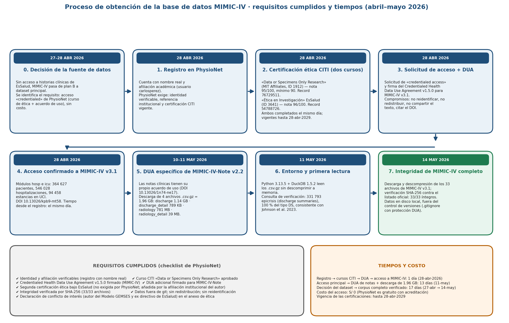

<!-- PORTADA-DOCX-INI -->
::: {custom-style="Title"}
{width=3.5cm}
:::

::: {custom-style="Subtitle"}
UNIVERSIDAD NACIONAL DE INGENIERÍA · Facultad de Ingeniería Industrial y de Sistemas · Maestría en Inteligencia Artificial
:::

::: {custom-style="Title"}
ENTREGABLE SEMANA 2
:::

::: {custom-style="Subtitle"}
Curso: MIA-14 · Trabajo de Investigación II · Sección B · 2026-2
:::

::: {custom-style="Author"}
**Proceso:** Diseño reproducible del flujo experimental: pipeline de aprendizaje supervisado para la detección y priorización de eventos adversos
:::

::: {custom-style="Author"}
**Tesis:** *Detección Automatizada y Priorización de Eventos Adversos en Notas Clínicas mediante un Flujo de Procesamiento (Pipeline) de NLP y Aprendizaje Automático — Aplicación de la Matriz de Priorización del Modelo GEMSES sobre MIMIC-IV*
:::

::: {custom-style="Author"}
Autor: Carlos Pérez Pérez · Docente: Dr. Ing. Glen Dario Rodríguez Rafael
:::

::: {custom-style="Date"}
Lima, 25 de septiembre de 2026
:::

```{=openxml}
<w:p><w:r><w:br w:type="page"/></w:r></w:p>
```
<!-- PORTADA-DOCX-FIN -->

**Tipo de tesis:** aprendizaje supervisado (clasificación de texto clínico), con dos adaptaciones: la etiqueta de entrenamiento es de *supervisión débil* (códigos CIE-10 causales) y la evaluación se cierra con un panel de expertos y con un corpus en español con etiqueta humana.

**Continuidad.** El título de la tesis es el mismo del proyecto aprobado en Trabajo de Investigación I (MIA-303, cerrado el 14-jul-2026). Lo que ha cambiado es lo que se ha probado y mejorado desde entonces: este diseño integra en un solo flujo la ejecución de la tesis (Fases 3v2 a 13), lo aprendido en el curso de Procesamiento de Lenguaje Natural (auditoría adversarial de 26 hallazgos) y la experiencia del sistema GEM·VigIA sobre reportes de EsSalud en producción. Todas las cifras provienen de archivos de resultados del proyecto; las que el propio proceso invalidó no se citan. Lo que es criterio propio va rotulado **[juicio técnico]**.

# 1. Diagrama del flujo principal

{width=96%}

# 2. Entradas, componentes y salida de cada etapa

| Etapa | Recibe | Qué hace | Produce (artefacto reproducible) |
|---|---|---|---|
| **1. Ingesta** | MIMIC-IV v3.1 + MIMIC-IV-Note v2.2 (acuerdo de uso PhysioNet), leídos con DuckDB | Extrae las epicrisis (*discharge summaries*) con identificador de paciente, de hospitalización y códigos de egreso | 331 793 epicrisis de 145 914 pacientes |
| **2. Preprocesamiento y etiqueta** | Epicrisis + diagnósticos codificados | Tier A: 223 códigos CIE-10 causales + 21 equivalencias OMS→CM → etiqueta A1 no circular; emparejamiento de época CIE-9/CIE-10 en los negativos; NegEx y regex Tier B solo como baseline | Corpus de modelado de 70 000 epicrisis con prevalencia real 0.2012 |
| **3. Partición y features** | Corpus de modelado | Partición por paciente (GroupShuffleSplit), test 20 %, semilla 42, con verificación de pacientes disjuntos; TF-IDF de palabras (1–2-gramas, 60 000 rasgos, mínimo 3 documentos) + TF-IDF de caracteres (3–5, 20 000 rasgos, mínimo 5), escala sublineal; el vocabulario se ajusta **solo con train** | Conjunto de datos final en formato Parquet; matrices dispersas |
| **4. Entrenamiento** | Matrices TF-IDF | Cascada de dos etapas: E1 detección evento sí/no con LinearSVC balanceado; E2 naturaleza del evento, 6 clases multietiqueta, OneVsRest(LinearSVC), entrenada solo con positivos y con su propia partición por paciente; prueba de abstención con 6 textos triviales | Modelo final serializado (10.7 MB, fuera de git por el acuerdo de uso) |
| **5. Evaluación** | Test reservado; panel experto; corpus ERSP | Métricas con IC95 por *bootstrap* (200 réplicas) por nota y por paciente; cascada extremo a extremo; sistema contra consenso de expertos | JSON de resultados finales; JSON de métricas corregidas; JSON de sistema contra experto |
| **6. Salida** | Detecciones por nota | Matriz de Priorización GEMSES (Anexo 03 de la Directiva N.º 7-OGCyH-ESSALUD-2020): G = 0.40·c + 0.20·d + 0.15·e + 0.25·f → percentiles P25/P50/P75 → banda Verde/Amarillo/Rojo y responsable | Tablero de priorización (prototipo) |

**Fuente de datos, unidad de análisis y variable objetivo.** La unidad de análisis es la epicrisis (una por hospitalización). La variable objetivo de E1 es binaria (¿la hospitalización tuvo un evento adverso codificado como causal?) y la de E2 es la *naturaleza* del evento según la Tabla de Codificación (Anexo 02 de la misma Directiva), reducida a 6 clases con n suficiente. No hay valores faltantes numéricos ni escalamiento: el texto es la única entrada del modelo y TF-IDF ya normaliza; la fusión con variables tabulares prevista en el proyecto original **nunca se ejecutó** y queda fuera de alcance.

**Regla de partición.** Se respeta la unidad *paciente*: ningún paciente aparece a la vez en train y test. En la Fase 4 se comprobó que el split por paciente no degrada el rendimiento (F1-macro 0.492 ± 0.018) y desde entonces es obligatorio. Desarrollo y ajuste se hacen con validación cruzada de 5 pliegues dentro del train; el test se toca una sola vez; el panel experto y el corpus ERSP actúan como evaluación externa.

# 3. Proceso de obtención de la base de datos MIMIC-IV

MIMIC-IV no se descarga libremente: PhysioNet (MIT) exige acreditación personal, formación en ética de investigación y un acuerdo de uso de datos. El proceso completo, con fechas y tiempos, fue el siguiente.

{width=96%}

| Paso | Fecha | Qué se hizo | Requisito que cubre |
|---|---|---|---|
| 0. Decisión de la fuente | 27–28 abr 2026 | Sin acceso a historias clínicas de EsSalud, MIMIC-IV pasa de plan B a dataset principal | Viabilidad del proyecto |
| 1. Registro en PhysioNet | 28 abr 2026 | Cuenta con nombre real y afiliación académica | Identidad y afiliación verificables |
| 2. Certificación ética CITI | 28 abr 2026 | Curso «Data or Specimens Only Research» (MIT Affiliates), nota 95/100 (mínimo 90); segundo curso «Ética en Investigación» bajo EsSalud, nota 96/100. Ambos vigentes hasta el 28 abr 2029 | Formación en protección de sujetos humanos y HIPAA |
| 3. Solicitud de acceso y acuerdo de uso | 28 abr 2026 | Solicitud de *credentialed access* y firma del *Credentialed Health Data Use Agreement* v1.5.0 para MIMIC-IV v3.1 | No reidentificar, no redistribuir, no compartir texto, citar el DOI |
| 4. Acceso confirmado a MIMIC-IV v3.1 | 28 abr 2026 | Módulos hosp e icu: 364 627 pacientes, 546 028 hospitalizaciones, 94 458 estancias en UCI (DOI 10.13026/kpb9-mt58) | Acceso otorgado |
| 5. Acuerdo específico de MIMIC-IV-Note v2.2 | 10–11 may 2026 | Las notas clínicas tienen su propio acuerdo de uso (DOI 10.13026/1n74-ne17); descarga de 4 archivos comprimidos = 1.96 GB (epicrisis 1.14 GB; radiología 781 MB; dos archivos de metadatos) | Acceso al texto libre |
| 6. Entorno y primera lectura | 11 may 2026 | Python 3.13.5 + DuckDB 1.5.2 leen los archivos comprimidos sin cargarlos a memoria; consulta de verificación: 331 793 epicrisis, 100 % del tipo *discharge summary*, consistente con el artículo oficial del dataset | Lectura reproducible |
| 7. Integridad del dataset completo | 14 may 2026 | Descarga y descompresión de los 33 archivos de MIMIC-IV v3.1; verificación SHA-256 contra el listado oficial: 33/33 íntegros; datos en disco local y excluidos del control de versiones | Integridad y cumplimiento del acuerdo |

**Tiempos.** Registro, cursos de ética, acuerdo de uso y acceso a MIMIC-IV: **1 día** (28 de abril de 2026). Desde el acceso principal hasta el acuerdo de notas y la descarga de 1.96 GB: **13 días**. Desde la decisión del dataset hasta el corpus completo verificado: **17 días** (27 de abril al 14 de mayo). **Costo:** S/ 0; el acceso es gratuito con acreditación.

**Requisitos adicionales que el proyecto se impuso:** segunda certificación ética bajo EsSalud (no exigida por PhysioNet, añadida por la afiliación institucional del autor); declaración explícita de conflicto de interés (autor del Modelo GEMSES y ex directivo de la instancia de EsSalud que emite la Directiva); acceso al texto de MIMIC-IV restringido al investigador principal, único acreditado; y exclusión de todo dato, modelo entrenado y copia de trabajo del repositorio de código.

# 4. Baseline, familia de modelos y alternativas ya descartadas

- **Baseline mínimo:** reglas regex Tier B + NegEx, precisión 65.7 % (IC95 54.0–75.8, n = 70, validación experta de mayo), y TF-IDF + regresión logística (Fase 4).
- **Familia elegida:** modelo lineal sobre TF-IDF (LinearSVC balanceado), en cascada. Es el modelo vigente desde la Fase 9 (29-jul-2026).
- **Alternativas probadas y refutadas** con la misma partición y semilla (hipótesis HE2): ClinicalBERT congelado F1-macro 0.19; Bio_ClinicalBERT y BioBERT con ajuste fino en GPU 0.21–0.35 (2.9–4.0 h) frente a 0.459 del lineal en 48 s; BioClinical ModernBERT con ventana de 1024 tokens 0.428 tras 42.5 h de GPU; Llama 3.2 3B *zero-shot* kappa 0.0 (dice sí a todo). Causa medida: la ventana de 256 tokens cubre el 9 % de una epicrisis (mediana 3 148 tokens). Se documenta como resultado negativo; solo se reabriría con Longformer o BigBird y GPU dedicada.

# 5. Criterio preliminar de evaluación

Toda comparación entre modelos se hace con la misma partición (semilla 42, por paciente) y se reporta siempre la cascada, porque el pipeline completo rinde menos que sus etapas.

| Nivel | Criterio | Situación al 25-set-2026 |
|---|---|---|
| **Métrica principal** | F1-macro de la **cascada completa** con IC95 por paciente (no la etapa aislada) | 0.363 en cascada frente a 0.536 de E2 aislada |
| Secundarias | E1: sensibilidad, especificidad, AUC y VPP a prevalencia real; E2: F1-micro; abstención | sens 0.762, esp 0.770, AUC 0.843, VPP 0.455; F1-micro 0.745; abstención 6/6 |
| **Bueno** | Supera el baseline de reglas **y** kappa sistema–experto ≥ 0.61 (umbral fijado en la hipótesis general del proyecto) | kappa 0.531 (n = 68, solo infección): **no alcanzado** |
| Aceptable | Supera el baseline lineal en cascada y F1 > 0.5 en toda clase con n ≥ 100 | Cumplido en Infección y Procedimiento; Sistema/Organización (n = 66) F1 0.0 |
| Fuera de alcance | Clases con n insuficiente: Sistema/Organización, Sangre/Hemoderivados, Nutrición | Declaradas no viables, no se intenta corregirlas |


# 6. Reproducibilidad

- **Versiones fijas:** MIMIC-IV v3.1 (DOI 10.13026/kpb9-mt58), MIMIC-IV-Note v2.2 (DOI 10.13026/1n74-ne17), Python 3.13.5, DuckDB 1.5.2; versión de scikit-learn **por fijar** en el archivo de dependencias.
- **Semillas:** 42 en la partición, en el muestreo del corpus y en el *bootstrap*.
- **Registro de experimentos:** un archivo JSON de resultados por fase, más bitácoras fechadas por sesión. Cada cifra del borrador de tesis lleva un comentario con el archivo del que proviene, verificado por script.
- **Artefactos:** modelo final serializado, conjunto de datos final (Parquet), JSON de resultados finales y JSON de métricas corregidas. Modelo y datos quedan fuera de git por el acuerdo de uso; el repositorio de la tesis es privado desde el 28-jul-2026.
- **Estado honesto (verificado el 25-set-2026):** no existe aún un archivo de dependencias con versiones fijadas, ni plantilla de variables de entorno, ni un orquestador que encadene las fases, ni la estructura data/raw y data/processed; hay 46 scripts, uno por fase; la sección "Cómo reproducir" del README apunta al notebook exploratorio y no a la cascada; los *checkpoints* de los transformers no se guardaron (solo son reproducibles reentrenando). **Sprint 1 del curso** = cerrar exactamente esto, con criterio de aceptación medible: que un tercero con credencial PhysioNet regenere la Fase 9 con un solo comando y obtenga sens 0.7623, esp 0.7699 y AUC 0.8426 con tolerancia ± 0.005.

# 7. Riesgos técnicos previsibles y cómo se detectan o mitigan

| Riesgo | Dónde se detectó (frente) | Mitigación incorporada al diseño |
|---|---|---|
| Fuga por circularidad regex → etiqueta | Tesis / PLN: enmascarar los disparadores solo baja 1.35 puntos | Etiqueta A1 derivada de códigos CIE-10 causales, no del regex |
| Confusor de época CIE-9/CIE-10 | Tesis, Fase 7: AUC 0.973 → 0.840 al emparejar | Emparejamiento de época en los negativos; la cifra 0.973 queda retirada |
| Fuga por paciente | PLN (auditoría adversarial) | Partición por paciente con verificación automática |
| Fuga por estilo de redacción | GEM·VigIA: el triaje reclamo/denuncia daba 98.4 %, y 91.5 % solo con palabras funcionales | Ablaciones de control; no se usan metadatos de quién redacta |
| Mezcla de centros asistenciales | GEM·VigIA sobre el mismo corpus ERSP: 0.77 estratificado frente a 0.42 por centro | El OE5 se re-mide con partición por centro antes de citarse; 0.7675 solo como cota superior |
| Datos insuficientes por clase | Tesis, Fases 4 y 9 | Clases con n < 100 declaradas no viables |
| Referencia de etiqueta débil | Panel experto limitado a infección; kappa 0.531 < 0.61 | Decisión de alcance (20-set): A1 como estándar plata principal, panel como validación secundaria; limitación declarada |
| Costo y latencia | Transformers 2.9–42.5 h de GPU frente a 48 s | Familia lineal; transformers cerrados como resultado negativo |
| Restricciones del entorno y datos personales | Acuerdo de uso PhysioNet; incidente del 28-jul con datos personales del corpus ERSP | Modelo y datos fuera de git; repositorio privado e historial reescrito; comunicaciones formales pendientes |
| Pérdida de resultados intermedios | Tesis: se perdieron las filas por nota del primer tramo (260 000) al morir el proceso | Orquestador con *checkpoint* por fase (Sprint 1) |

# 8. Verificación contra la guía (sección 11)

Diagrama acorde al tipo de tesis, entradas y salidas por etapa, criterio de resultado correcto, registro para reproducir, separación desarrollo/evaluación y riesgos (diez): cubiertos en las secciones 1 a 7. Alcance ejecutable con los recursos del curso: **[juicio técnico]** sí, porque el modelo ya existe, el acceso a los datos está vigente hasta 2029 y el Sprint 1 es de reproducibilidad, no de modelado.
