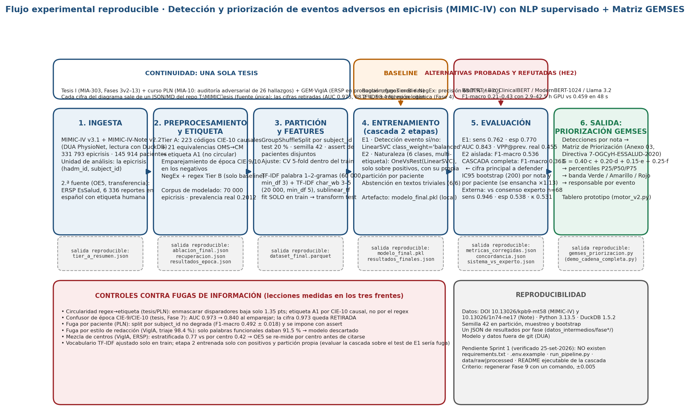

**Tipo de tesis:** aprendizaje supervisado (clasificación de texto clínico), con dos adaptaciones: la etiqueta de entrenamiento es de *supervisión débil* (códigos CIE-10 causales) y la evaluación se cierra con un panel de expertos y con un corpus en español con etiqueta humana.

**Continuidad.** Este diseño no parte de cero. Es la continuación de Trabajo de Investigación I (MIA-303, Mg. María Tejada, cerrado el 14-jul-2026) e integra en un solo flujo lo aprendido en tres frentes: la tesis (Fases 3v2 a 13), el curso de PLN (MIA-10, auditoría adversarial de 26 hallazgos) y GEM·VigIA (corpus ERSP de EsSalud en producción). Cada cifra sale de un archivo de resultados del repositorio de la tesis (fuente única); las cifras que el propio proceso invalidó no se citan. Lo que es criterio propio va rotulado **[juicio técnico]**.

# 1. Diagrama del flujo principal

# 2. Entradas, componentes y salida de cada etapa

| Etapa | Recibe | Qué hace | Produce (artefacto reproducible) |
|---|---|---|---|
| **1. Ingesta** | MIMIC-IV v3.1 + MIMIC-IV-Note v2.2 (DUA PhysioNet), leídos con DuckDB | Extrae las epicrisis (*discharge summaries*) con `subject_id`, `hadm_id` y códigos de egreso | 331 793 epicrisis de 145 914 pacientes (`fase3_v2/ablacion_final.json`) |
| **2. Preprocesamiento y etiqueta** | Epicrisis + diagnósticos codificados | Tier A: 223 códigos CIE-10 causales + 21 equivalencias OMS→CM → etiqueta A1 no circular; emparejamiento de época CIE-9/CIE-10 en los negativos; NegEx y regex Tier B solo como baseline | Corpus de modelado de 70 000 epicrisis con prevalencia real 0.2012 (`fase9_final/resultados_finales.json`) |
| **3. Partición y features** | Corpus de modelado | `GroupShuffleSplit` por paciente, test 20 %, semilla 42, con *assert* de pacientes disjuntos; TF-IDF de palabras (1–2-gramas, 60 000 rasgos, `min_df` 3) + TF-IDF de caracteres `char_wb` (3–5, 20 000, `min_df` 5), `sublinear_tf`; el vocabulario se ajusta **solo con train** | `dataset_final.parquet`; matrices dispersas (`fase9_modelo_final.py`, líneas 223–250) |
| **4. Entrenamiento** | Matrices TF-IDF | Cascada de dos etapas: E1 detección evento sí/no con `LinearSVC(class_weight="balanced")`; E2 naturaleza del evento, 6 clases multietiqueta, `OneVsRest(LinearSVC)`, entrenada solo con positivos y con su propia partición por paciente; prueba de abstención con 6 textos triviales | `modelo_final.pkl` (10.7 MB, fuera de git por el DUA) |
| **5. Evaluación** | Test reservado; panel experto; ERSP | Métricas con IC95 por *bootstrap* (200 réplicas) por nota y por paciente; cascada extremo a extremo; sistema contra consenso de expertos | `resultados_finales.json`, `metricas_corregidas.json`, `fase12/sistema_vs_experto.json` |
| **6. Salida** | Detecciones por nota | Matriz de Priorización GEMSES (Anexo 03 de la Directiva N.º 7-OGCyH-ESSALUD-2020): G = 0.40·c + 0.20·d + 0.15·e + 0.25·f → percentiles P25/P50/P75 → banda Verde/Amarillo/Rojo y responsable | Tablero de priorización (`05_prototipo_app/motor_v2.py`, `gemses_priorizacion.py`) |

**Fuente de datos, unidad de análisis y variable objetivo.** La unidad de análisis es la epicrisis (una por hospitalización). La variable objetivo de E1 es binaria (¿la hospitalización tuvo un evento adverso codificado como causal?) y la de E2 es la *naturaleza* del evento según la Tabla de Codificación (Anexo 02 de la misma Directiva), reducida a 6 clases con n suficiente. No hay valores faltantes numéricos ni escalamiento: el texto es la única entrada del modelo y TF-IDF ya normaliza; la fusión con variables tabulares prevista en el proyecto original **nunca se ejecutó** y queda fuera de alcance.

**Regla de partición.** Se respeta la unidad *paciente*: ningún `subject_id` aparece a la vez en train y test. En la Fase 4 se comprobó que el split por paciente no degrada el rendimiento (F1-macro 0.492 ± 0.018) y desde entonces es obligatorio (`fase4/RESULTADOS_FASE4.md`). Desarrollo y ajuste se hacen con validación cruzada de 5 pliegues dentro del train; el test se toca una sola vez; el panel experto y el corpus ERSP actúan como evaluación externa.

# 3. Baseline, familia de modelos y alternativas ya descartadas

- **Baseline mínimo:** reglas regex Tier B + NegEx, precisión 65.7 % (IC95 54.0–75.8, n = 70, `05_validacion_experta/REPORTE_VALIDACION_70_EVENTOS.md`), y TF-IDF + regresión logística (Fase 4).
- **Familia elegida:** modelo lineal sobre TF-IDF (LinearSVC balanceado), en cascada. Es el modelo vigente desde la Fase 9 (29-jul-2026).
- **Alternativas probadas y refutadas** con la misma partición y semilla (hipótesis HE2): ClinicalBERT congelado F1-macro 0.19; Bio_ClinicalBERT y BioBERT con ajuste fino en GPU 0.21–0.35 (2.9–4.0 h) frente a 0.459 del lineal en 48 s (`fase11/resultados_transformers.json`); BioClinical ModernBERT con ventana de 1024 tokens 0.428 tras 42.5 h de GPU (`fase13/modernbert_final.json`); Llama 3.2 3B *zero-shot* kappa 0.0 (dice sí a todo, `fase13/llm_local_vs_experto.json`). Causa medida: la ventana de 256 tokens cubre el 9 % de una epicrisis (mediana 3 148 tokens). Se documenta como resultado negativo; solo se reabriría con Longformer o BigBird y GPU dedicada.

# 4. Criterio preliminar de evaluación

| Nivel | Criterio | Situación al 25-set-2026 |
|---|---|---|
| **Métrica principal** | F1-macro de la **cascada completa** con IC95 por paciente (no la etapa aislada) | 0.363 en cascada frente a 0.536 de E2 aislada (`metricas_corregidas.json`) |
| Secundarias | E1: sensibilidad, especificidad, AUC y VPP a prevalencia real; E2: F1-micro; abstención | sens 0.762, esp 0.770, AUC 0.843, VPP 0.455; F1-micro 0.745; abstención 6/6 |
| **Bueno** | Supera el baseline de reglas **y** kappa sistema–experto ≥ 0.61 (umbral de la hipótesis general, `Capitulo3.tex:321`) | kappa 0.531 (n = 68, solo infección): **no alcanzado** |
| Aceptable | Supera el baseline lineal en cascada y F1 > 0.5 en toda clase con n ≥ 100 | Cumplido en Infección y Procedimiento; Sistema/Organización (n = 66) F1 0.0 |
| Fuera de alcance | Clases con n insuficiente: Sistema/Organización, Sangre/Hemoderivados, Nutrición | Declaradas no viables, no se intenta corregirlas |

Toda comparación entre modelos se hace con la misma partición (semilla 42, por paciente) y se reporta siempre la cascada, porque el pipeline completo rinde menos que sus etapas.

# 5. Reproducibilidad

- **Versiones fijas:** MIMIC-IV v3.1 (DOI 10.13026/kpb9-mt58), MIMIC-IV-Note v2.2 (DOI 10.13026/1n74-ne17), Python 3.13.5, DuckDB 1.5.2; versión de scikit-learn **por fijar** en `requirements.txt`.
- **Semillas:** 42 en la partición, en el muestreo del corpus y en el *bootstrap* (`SEED = 42`, `fase9_modelo_final.py:93`).
- **Registro de experimentos:** un JSON de resultados por fase en `04_pipeline_codigo/datos_intermedios/fase*/`, más bitácoras fechadas en `07_bitacoras/`. Cada cifra del borrador de tesis lleva un comentario `% fuente:` con su archivo.
- **Artefactos:** `modelo_final.pkl`, `dataset_final.parquet`, `resultados_finales.json`, `metricas_corregidas.json`. Modelo y datos quedan fuera de git por el DUA; el repositorio de la tesis es privado desde el 28-jul-2026.
- **Estado honesto (verificado en disco el 25-set-2026):** no existen `requirements.txt`, `.env.example`, `run_pipeline.py` ni `data/raw` y `data/processed`; hay 46 scripts, uno por fase, sin orquestador; la sección "Cómo reproducir" del README apunta al notebook exploratorio y no a la cascada; los *checkpoints* de los transformers no se guardaron (solo son reproducibles reentrenando). **Sprint 1 del curso** = cerrar exactamente esto, con criterio de aceptación medible: que un tercero con credencial PhysioNet regenere la Fase 9 con un solo comando y obtenga sens 0.7623, esp 0.7699 y AUC 0.8426 con tolerancia ± 0.005.

# 6. Riesgos técnicos previsibles y cómo se detectan o mitigan

| Riesgo | Dónde se detectó (frente) | Mitigación incorporada al diseño |
|---|---|---|
| Fuga por circularidad regex → etiqueta | Tesis / PLN: enmascarar los disparadores solo baja 1.35 puntos | Etiqueta A1 derivada de códigos CIE-10 causales, no del regex |
| Confusor de época CIE-9/CIE-10 | Tesis, Fase 7: AUC 0.973 → 0.840 al emparejar | Emparejamiento de época en los negativos; la cifra 0.973 queda retirada |
| Fuga por paciente | PLN (auditoría adversarial) | Partición por `subject_id` con *assert* |
| Fuga por estilo de redacción | GEM·VigIA: el triaje reclamo/denuncia daba 98.4 %, y 91.5 % solo con palabras funcionales | Ablaciones de control; no se usan metadatos de quién redacta |
| Mezcla de centros asistenciales | GEM·VigIA sobre el mismo corpus ERSP: 0.77 estratificado frente a 0.42 por centro | El OE5 se re-mide con partición por centro antes de citarse; 0.7675 solo como cota superior |
| Datos insuficientes por clase | Tesis, Fases 4 y 9 | Clases con n < 100 declaradas no viables |
| Referencia de etiqueta débil | Panel experto limitado a infección; kappa 0.531 < 0.61 | Decisión de alcance (20-set): A1 como estándar plata principal, panel como validación secundaria; limitación declarada |
| Costo y latencia | Transformers 2.9–42.5 h de GPU frente a 48 s | Familia lineal; transformers cerrados como resultado negativo |
| Restricciones del entorno y datos personales | DUA PhysioNet; incidente del 28-jul (repo público con DNI de ERSP) | Modelo y datos fuera de git; repo privado e historial reescrito; ticket a GitHub y aviso al DPO de EsSalud **pendientes** |
| Pérdida de resultados intermedios | Tesis: se perdieron las filas por nota del primer tramo (260 000) al morir el proceso | Orquestador con *checkpoint* por fase (Sprint 1) |

# 7. Verificación contra la guía (sección 11)

El diagrama corresponde a una tesis supervisada y declara sus adaptaciones (sí). Entradas y salidas de cada etapa (sí, tabla 2). Resultado correcto, útil o mejor que el baseline (sí, sección 4). Qué se registra para reproducir (sí, sección 5). Desarrollo/ajuste separado de evaluación final (sí, sección 2). Al menos dos riesgos (sí, diez en la sección 6). Alcance ejecutable con los recursos del curso: **[juicio técnico]** sí, porque el modelo ya existe y el Sprint 1 es de reproducibilidad, no de modelado.

**Fuentes abiertas para este entregable:** `11_proyecto_II/01_INVENTARIO_MODELOS_Y_CHECKLIST_2026-09-18.md` y `02_ESTADO_DE_AVANCE_COMPLETO_2026-09-18.md`; `04_pipeline_codigo/fase9_modelo_final.py` y `fase10_metricas_corregidas.py`; los JSON citados en `04_pipeline_codigo/datos_intermedios/`; `latex_tesis/3_1_CAPITULO_MARCO_TEORICO/Capitulo3.tex`; Directiva N.º 7-OGCyH-ESSALUD-2020 (RGG 402-GG-ESSALUD-2020), Anexos 02 y 03. Todo en el repositorio de la tesis `tesis-gemses-mimic-pipeline`.
